Raft 

https://github.com/maemual/raft-zh_cn/blob/master/raft-zh_cn.md

http://thesecretlivesofdata.com/raft/

https://segmentfault.com/a/1190000004961650

https://raft.github.io/raftscope-replay/index.html

Raft是一种为了管理复制日志的一致性算法。它提供了和 Paxos 算法相同的功能和性能，但是它的算法结构和 Paxos 不同，使得 Raft 算法更加容易理解并且更容易构建实际的系统。为了提升可理解性，Raft 将一致性算法分解成了几个关键模块，例如领导人选举、日志复制和安全性。同时它通过实施一个更强的一致性来减少需要考虑的状态的数量。从一个用户研究的结果可以证明，对于学生而言，Raft 算法比 Paxos 算法更加容易学习。Raft 算法还包括一个新的机制来允许集群成员的动态改变，它利用重叠的大多数来保证安全性。

# Raft 一致性算法

Raft 通过选举一个高贵的领导人，然后给予他全部的管理复制日志的责任来实现一致性。领导人从客户端接收日志条目，把日志条目复制到其他服务器上，并且当保证安全性的时候告诉其他的服务器应用日志条目到他们的状态机中。拥有一个领导人大大简化了对复制日志的管理。例如，领导人可以决定新的日志条目需要放在日志中的什么位置而不需要和其他服务器商议，并且数据都从领导人流向其他服务器。一个领导人可以宕机，可以和其他服务器失去连接，这时一个新的领导人会被选举出来。

通过领导人的方式，Raft 将一致性问题分解成了三个相对独立的子问题，这些问题会在接下来的子章节中进行讨论：

    领导选举：当先存的领导人宕机的时候，一个新的领导人需要被选举出来
    日志复制：领导人必须从客户端接收日志然后复制到集群中的其他节点，并且强制要求其他节点的日志保持和自己相同。
    安全性：如果有任何的服务器节点已经应用了一个确定的日志条目到它的状态机中，那么其他服务器节点不能在同一个日志索引位置应用一个不同的指令

下面我们根据[https://raft.github.io/raftscope-replay/index.html](https://raft.github.io/raftscope-replay/index.html "Raft动画")提供的动画演示来了解raft协议的过程

动画其中包含五个server，分别名为s1到s5

# 领导选举

每个服务器节点有三种状态：跟随者(Follower)、候选人（Candidate）、领导人（Leader）

Raft 使用一种心跳机制来触发领导人选举。当服务器程序启动时，他们都是跟随者身份。如果一个服务器节点从领导人或者候选者处接收到有效的RPCs,它将继续保持着跟随者状态。领导者周期性的向所有跟随者发送心跳包（不包含日志项内容的附加日志项 RPCs）来维持自己的权威。如果一个跟随者在一段时间里没有接收到任何消息，也就是选举超时，然后他就会认为系统中没有可用的领导者然后开始进行选举以选出新的领导者。

要开始一次选举过程，跟随者先要增加自己的当前任期号并且转换到候选人状态。然后他会并行的向集群中的其他服务器节点发送请求投票的 RPCs 来给自己投票。候选人会继续保持着当前状态直到以下三件事情之一发生：(a) 他自己赢得了这次的选举，(b) 其他的服务器成为领导者，(c) 一段时间之后没有任何一个获胜的人。

当一个候选人从整个集群的大多数服务器节点获得了针对同一个任期号的选票，那么他就赢得了这次选举并成为领导人。每一个服务器最多会对一个任期号投出一张选票，按照先来先服务的原则。要求大多数选票的规则确保了最多只会有一个候选人赢得此次选举（图 3 中的选举安全性）。一旦候选人赢得选举，他就立即成为领导人。然后他会向其他的服务器发送心跳消息来建立自己的权威并且阻止新的领导人的产生。

在等待投票的时候，候选人可能会从其他的服务器接收到声明它是领导人的附加日志项 RPC。如果这个领导人的任期号（包含在此次的 RPC中）不小于候选人当前的任期号，那么候选人会承认领导人合法并回到跟随者状态。 如果此次 RPC 中的任期号比自己小，那么候选人就会拒绝这次的 RPC 并且继续保持候选人状态。

第三种可能的结果是候选人既没有赢得选举也没有输：如果有多个跟随者同时成为候选人，那么选票可能会被瓜分以至于没有候选人可以赢得大多数人的支持。当这种情况发生的时候，每一个候选人都会超时，然后通过增加当前任期号来开始一轮新的选举。然而，没有其他机制的话，选票可能会被无限的重复瓜分。

Raft 算法使用随机选举超时时间的方法来确保很少会发生选票瓜分的情况，就算发生也能很快的解决。为了阻止选票起初就被瓜分，选举超时时间是从一个固定的区间（例如 150-300毫秒）随机选择。这样可以把服务器都分散开以至于在大多数情况下只有一个服务器会选举超时；然后他赢得选举并在其他服务器超时之前发送心跳包。同样的机制被用在选票瓜分的情况下。每一个候选人在开始一次选举的时候会重置一个随机的选举超时时间，然后在下次选举之前一直等待；这样减少了在新的选举中另外的选票瓜分的可能性。

在最开始是没有leader的，它们都是跟随者身份

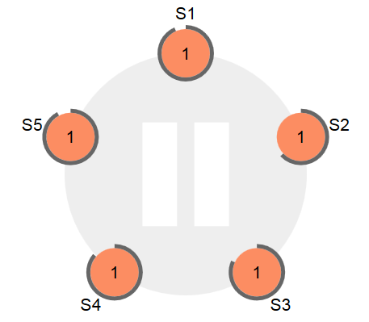

S2服务器计时器最先结束，成为候选人

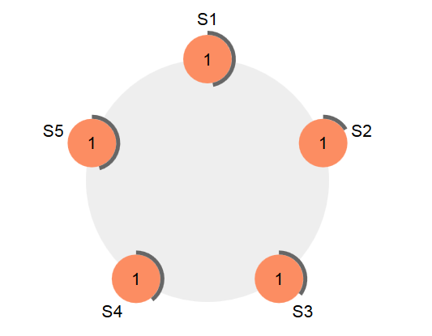

S2发起leader的选举，推荐自己为leader，只要大多数节点响应它，则他就会成为leader

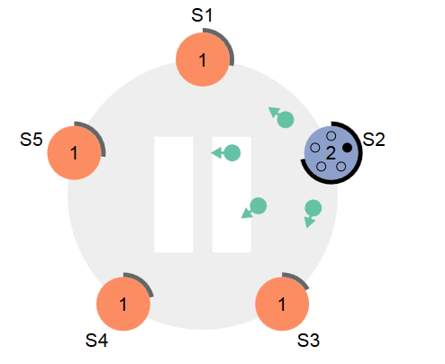

所有的结点都同意S2为leader，所以S2成为了leader。

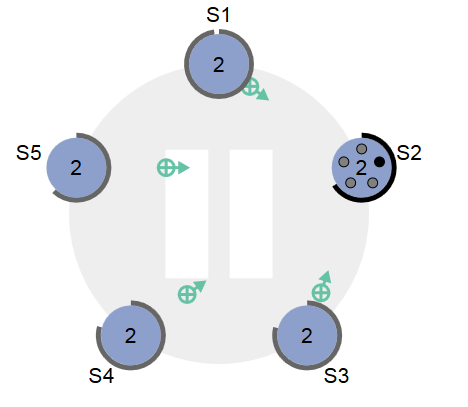

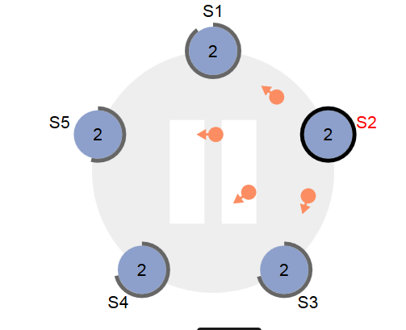

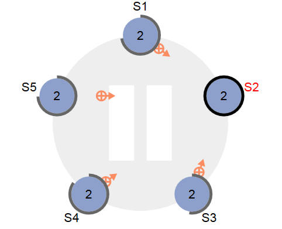

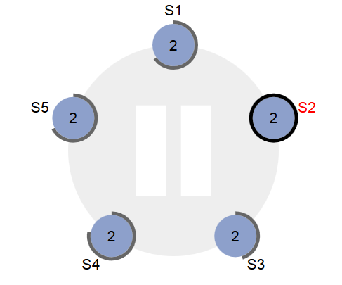

## Leader 宕机的处理
可以看到现在S2已经宕了

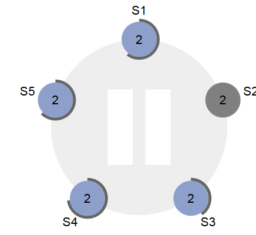

每个server的计时器一直都在运行，当S2down了后，一直没有收到S2的心跳信息，自己的计时器则会慢慢的到时，现在S3的计时器已经快要到时间了。

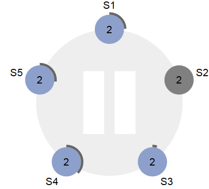

S3时间到，现在发起新一轮的选举，S3想成为leader，现在活着的机器超过半数，所以S3会成功成为leader

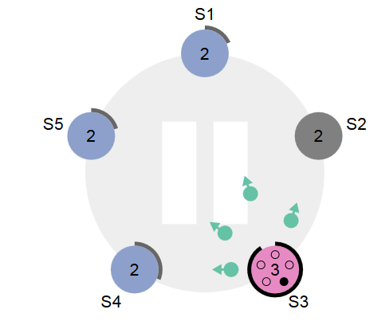

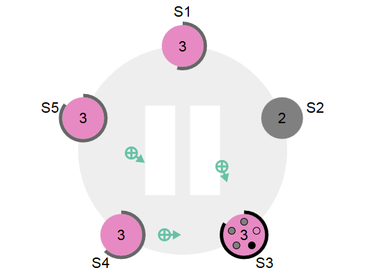

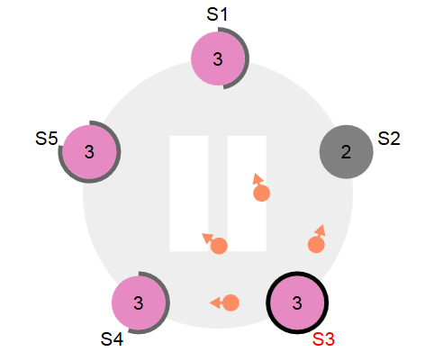

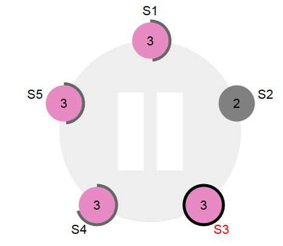

如果两个结点同时发生选举，且同时获得相同的投票会发生什么呢？下面可以看到S1和 S5几乎同时发起选举

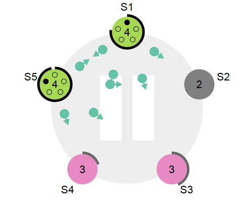

之后我们可以看到S1和S5全部都有两个投票，这个时候S2的投票至关重要，因为谁拿到S2的票，谁就是leader了，然而S2挂了

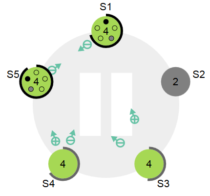

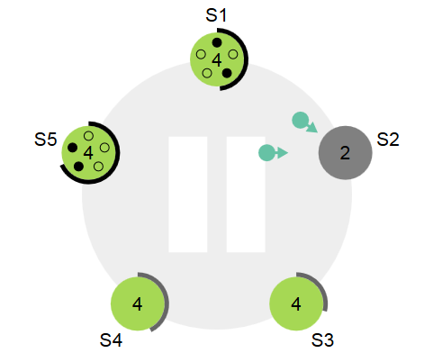

索引这时候谁都拿不到最后一票，但是其他的结点不会一直等待，可以看到S3的计时器到时，然后发起了新一轮的选举，然后成功成为leader

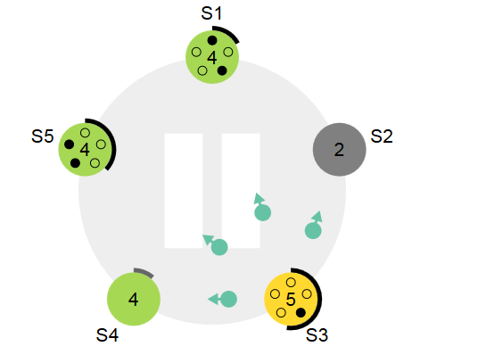

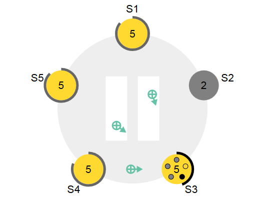

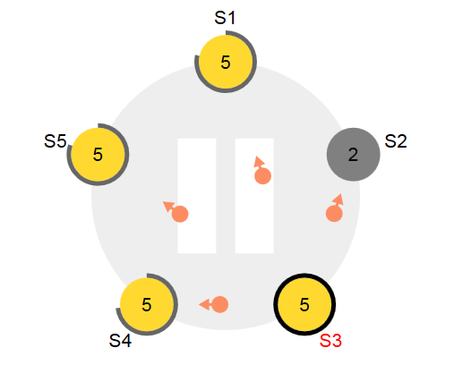

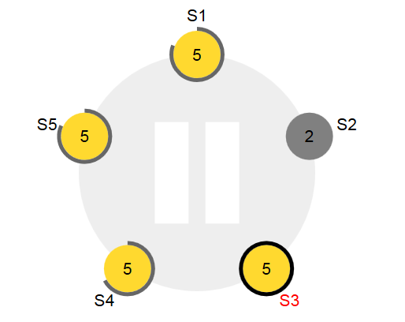

# 日志复制

一旦一个领导人被选举出来，他就开始为客户端提供服务。客户端的每一个请求都包含一条被复制状态机执行的指令。领导人把这条指令作为一条新的日志条目附加到日志中去，然后并行的发起附加条目 RPCs 给其他的服务器，让他们复制这条日志条目。当这条日志条目被安全的复制（下面会介绍），领导人会应用这条日志条目到它的状态机中然后把执行的结果返回给客户端。如果跟随者崩溃或者运行缓慢，再或者网络丢包，领导人会不断的重复尝试附加日志条目 RPCs （尽管已经回复了客户端）直到所有的跟随者都最终存储了所有的日志条目。

领导人来决定什么时候把日志条目应用到状态机中是安全的；这种日志条目被称为已提交。Raft 算法保证所有已提交的日志条目都是持久化的并且最终会被所有可用的状态机执行。在领导人将创建的日志条目复制到大多数的服务器上的时候，日志条目就会被提交。同时，领导人的日志中之前的所有日志条目也都会被提交，包括由其他领导人创建的条目。领导人跟踪了最大的将会被提交的日志项的索引，并且索引值会被包含在未来的所有附加日志 RPCs （包括心跳包），这样其他的服务器才能最终知道领导人的提交位置。一旦跟随者知道一条日志条目已经被提交，那么他也会将这个日志条目应用到本地的状态机中（按照日志的顺序）。

我们设计了 Raft 的日志机制来维护一个不同服务器的日志之间的高层次的一致性。这么做不仅简化了系统的行为也使得更加可预计，同时他也是安全性保证的一个重要组件。Raft 维护着以下的特性：

    如果在不同的日志中的两个条目拥有相同的索引和任期号，那么他们存储了相同的指令。
    如果在不同的日志中的两个条目拥有相同的索引和任期号，那么他们之前的所有日志条目也全部相同。

第一个特性来自这样的一个事实，领导人最多在一个任期里在指定的一个日志索引位置创建一条日志条目，同时日志条目在日志中的位置也从来不会改变。第二个特性由附加日志 RPC 的一个简单的一致性检查所保证。在发送附加日志 RPC 的时候，领导人会把新的日志条目紧接着之前的条目的索引位置和任期号包含在里面。如果跟随者在它的日志中找不到包含相同索引位置和任期号的条目，那么他就会拒绝接收新的日志条目。一致性检查就像一个归纳步骤：一开始空的日志状态肯定是满足日志匹配特性的，然后一致性检查保护了日志匹配特性当日志扩展的时候。因此，每当附加日志 RPC 返回成功时，领导人就知道跟随者的日志一定是和自己相同的了。

	当一个领导人成功当选时，跟随者可能是任何情况（a-f）。每一个盒子表示是一个日志条目；里面的数字表示任期号。跟随者可能会缺少一些日志条目（a-b），可能会有一些未被提交的日志条目（c-d），或者两种情况都存在（e-f）。例如，场景 f 可能这样发生，那个服务器在任期 2 的时候是领导人，附加了一些日志条目到自己的日志中，在提交之前就崩溃了；很快这个机器就重启了，在任期 3 重新被选为领导人，并且又增加了一些日志条目到自己的日志中；在这些任期 2 和任期 3 重点日志被提交之前，这个服务器又宕机了，然后的几个任期里一直处于宕机状态。

在正常的操作中，领导人和跟随者的日志保持一致性，所以附加日志 RPC 的一致性检查从来不会失败。然而，领导人崩溃的情况会使得日志处于不一致的状态（老的领导人可能还没有完全复制所有的日志条目）。这种不一致问题会在一系列的领导人和跟随者崩溃的情况下加剧。上图展示了跟随者的日志可能和新的领导人不同的方式。跟随者可能会丢失一些在新的领导人中有的日志条目，他也可能拥有一些领导人没有的日志条目，或者两者都发生。丢失或者多出日志条目可能会持续多个任期。

在 Raft 算法中，领导人处理不一致是通过强制跟随者直接复制自己的日志来解决了。这意味着在跟随者中的冲突的日志条目会被领导人的日志覆盖

要使得跟随者的日志进入和自己一致的状态，领导人必须找到最后两者达成一致的地方，然后删除从那个点之后的所有日志条目，发送自己的日志给跟随者。所有的这些操作都在进行附加日志 RPCs 的一致性检查时完成。领导人针对每一个跟随者维护了一个 nextIndex，这表示下一个需要发送给跟随者的日志条目的索引地址。当一个领导人刚获得权力的时候，他初始化所有的 nextIndex 值为自己的最后一条日志的index加1。如果一个跟随者的日志和领导人不一致，那么在下一次的附加日志 RPC 时的一致性检查就会失败。在被跟随者拒绝之后，领导人就会减小 nextIndex 值并进行重试。最终 nextIndex 会在某个位置使得领导人和跟随者的日志达成一致。当这种情况发生，附加日志 RPC 就会成功，这时就会把跟随者冲突的日志条目全部删除并且加上领导人的日志。一旦附加日志 RPC 成功，那么跟随者的日志就会和领导人保持一致，并且在接下来的任期里一直继续保持。

如果需要的话，算法可以通过减少被拒绝的附加日志 RPCs 的次数来优化。例如，当附加日志 RPC 的请求被拒绝的时候，跟随者可以包含冲突的条目的任期号和自己存储的那个任期的最早的索引地址。借助这些信息，领导人可以减小 nextIndex 越过所有那个任期冲突的所有日志条目；这样就变成每个任期需要一次附加条目 RPC 而不是每个条目一次。在实践中，我们十分怀疑这种优化是否是必要的，因为失败是很少发生的并且也不大可能会有这么多不一致的日志

通过这种机制，领导人在获得权力的时候就不需要任何特殊的操作来恢复一致性。他只需要进行正常的操作，然后日志就能自动的在回复附加日志 RPC 的一致性检查失败的时候自动趋于一致。领导人从来不会覆盖或者删除自己的日志（图 3 的领导人只附加特性）。

日志复制机制展示出了一致性特性：Raft 能够接受，复制并应用新的日志条目只要大部分的机器是工作的；在通常的情况下，新的日志条目可以在一次 RPC 中被复制给集群中的大多数机器；并且单个的缓慢的跟随者不会影响整体的性能。

下面通过动画来了解日志复制机制

刚开始所有节点的日志都是空的

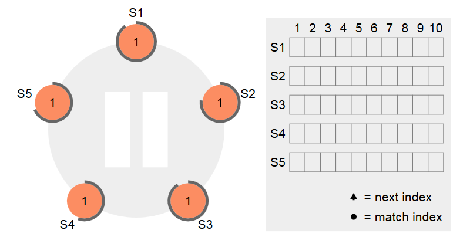

S1成为Leader，向其他节点同步自己的日志

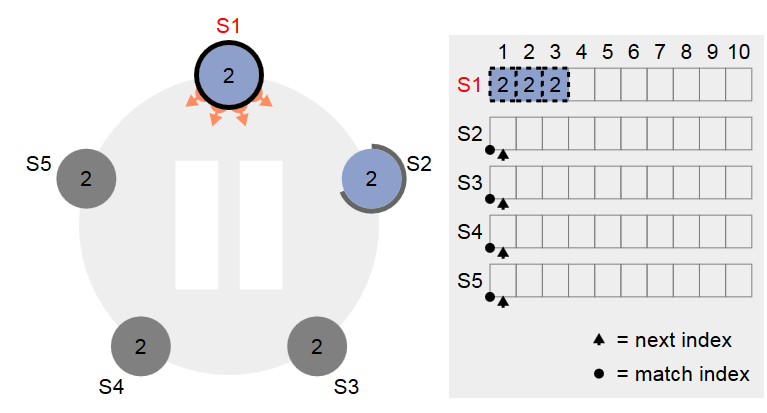

S2复制完成，但是现在还没有超过半数的节点确认

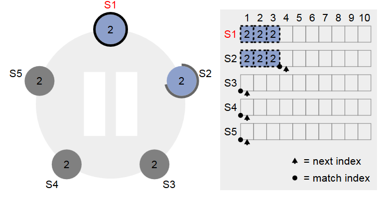

S3复制

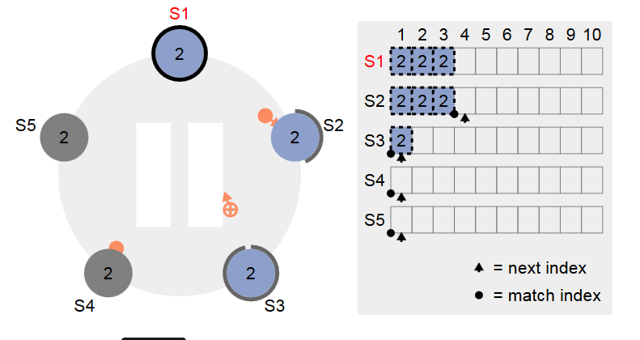

第一个日志超过半数确认，S1认为达成一致

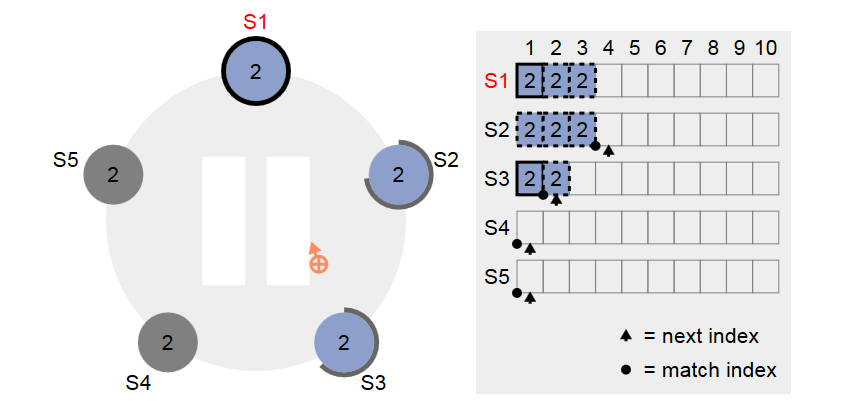

第三个日志超过半数确认，S1认为达成一致

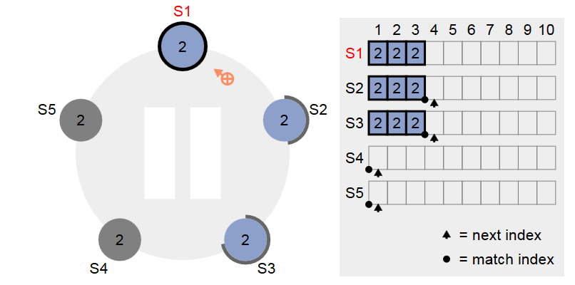

S1又更新两条日志，但是还未同步到其他节点,S1就已经挂了，这时，S2成为Leader,S4启动

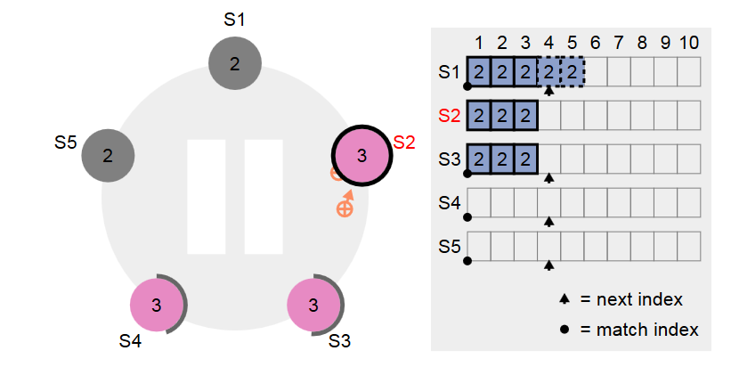

S2向S4同步日志

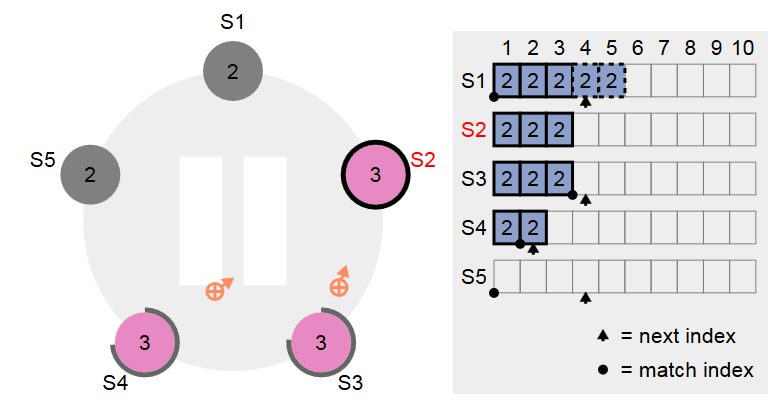

S2、S3、S4最终达成一致

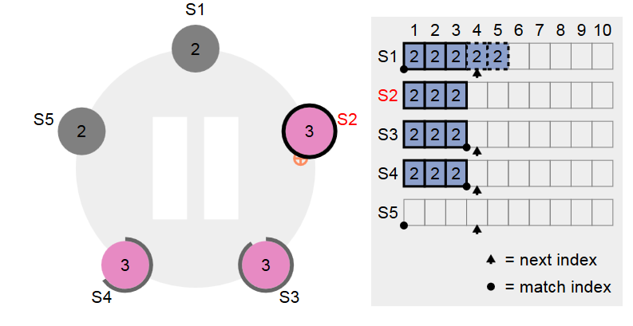

S2更新日志，同步到S3、S4

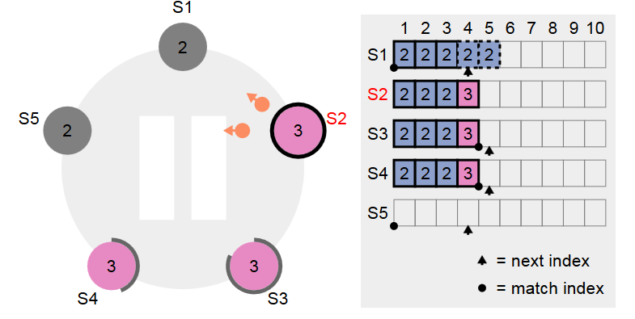

S1启动

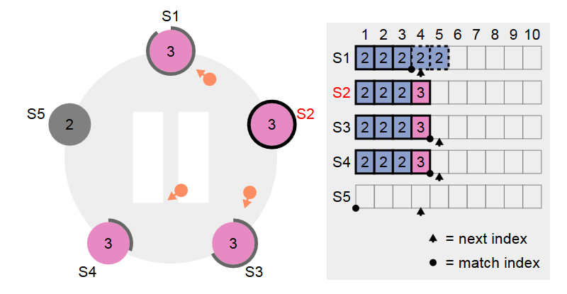

S1从S2同步日志，丢弃不一致的两个日志

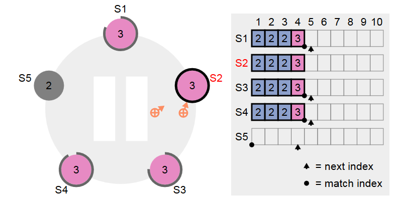

# 安全性

前面的章节里描述了 Raft 算法是如何选举和复制日志的。然而，到目前为止描述的机制并不能充分的保证每一个状态机会按照相同的顺序执行相同的指令。例如，一个跟随者可能会进入不可用状态同时领导人已经提交了若干的日志条目，然后这个跟随者可能会被选举为领导人并且覆盖这些日志条目；因此，不同的状态机可能会执行不同的指令序列。

这一节通过在领导选举的时候增加一些限制来完善了 Raft 算法。这一限制保证了任何的领导人对于给定的任期号，都拥有了之前任期的所有被提交的日志条目。增加这一选举时的限制，我们对于提交时的规则也更加清晰。最终，我们展示对于领导人完整特性的简要证明并且说明领导人是如何领导复制状态机的正确行为的。

## 选举限制

在任何基于领导人的一致性算法中，领导人都必须存储所有已经提交的日志条目。在某些一致性算法中，例如 Viewstamped Replication，一个人可以被选举为领导人即使他一开始并没有包含所有已经提交的日志条目。这种算法包含一些额外的机制来识别丢失的日志条目并把他们传送给新的领导人，要么是在选举阶段要么在之后很快进行。不幸的是，这种方法会导致相当大的额外的机制和复杂性。Raft 使用了一种更加简单的方法，它可以保证所有之前的任期号中已经提交的日志条目在选举的时候都会出现在新的领导人中，不需要传送这些日志条目给领导人。这意味着日志条目的传送是单向的，只从领导人传给跟随者，并且领导人从不会覆盖本地日志中已经存在的条目。

Raft 使用投票的方式来阻止候选人赢得选举除非这个候选人包含了所有已经提交的日志条目。候选人为了赢得选举必须联系集群中的大部分节点，这意味着每一个已经提交的日志条目肯定在这些服务器节点中至少存在一个上面。如果候选人的日志至少和大多数的服务器节点一样新（这个新的定义会在下面讨论），那么他一定持有了所有已经提交的日志条目。请求投票 RPC 实现了这样的限制： RPC 中包含了候选人的日志信息，然后投票人会拒绝掉那些日志没有自己新的投票请求。

Raft 通过比较两份日志中最后一条日志条目的索引值和任期号定义谁的日志比较新。如果两份日志最后的条目的任期号不同，那么任期号大的日志更加新。如果两份日志最后的条目任期号相同，那么日志比较长的那个就更加新。

## 提交之前任期内的日志条目

领导人知道一条当前任期内的日志记录是可以被提交的，只要它被存储到了大多数的服务器上。如果一个领导人在提交日志条目之前崩溃了，未来后续的领导人会继续尝试复制这条日志记录。然而，一个领导人不能断定一个之前任期里的日志条目被保存到大多数服务器上的时候就一定已经提交了。下图 展示了一种情况，一条已经被存储到大多数节点上的老日志条目，也依然有可能会被未来的领导人覆盖掉。

	如图的时间序列展示了为什么领导人无法通过老的日志的任期号来判断其提交状态。在 (a) 中，S1 是领导者，部分的复制了索引位置 2 的日志条目。在 (b) 中，S1 崩溃了，然后 S5 在任期 3 里通过 S3、S4 和自己的选票赢得选举，然后从客户端接收了一条不一样的日志条目放在了索引 2 处。然后到 (c)，S5 又崩溃了；S1 重新启动，选举成功，开始复制日志。在这时，来自任期 2 的那条日志已经被复制到了集群中的大多数机器上，但是还没有被提交。如果 S1 在 (d) 中又崩溃了，S5 可以重新被选举成功（通过来自 S2，S3 和 S4 的选票），然后覆盖了他们在索引 2 处的日志。但是，在崩溃之前，如果 S1 在自己的任期里复制了日志条目到大多数机器上，如 (e) 中，然后这个条目就会被提交（S5 就不可能选举成功）。 在这个时候，之前的所有日志就会被正常提交处理。

为了消除上图描述的情况，Raft 通过计算副本数目的方式，使得永远不会提交一个之前任期内的日志条目。通过计算副本数目，只有领导人当前任期里的日志条目可以被提交；一旦当前任期的日志条目以这种方式被提交，那么由于日志匹配特性，之前的日志条目也都会被间接的提交。在某些情况下，领导人可以安全的知道一个老的日志条目是否已经被提交（例如，该条目是否存储到所有服务器上），但是 Raft 为了简化问题使用一种更加保守的方法。

**后面的一些描述不在摘抄**

下面通过动画来了解下安全性

Raft协议的安全机制保证，如果leader选举的节点的日志比投票结点的日志信息要老，那么投票结点是不会给他投票的。所有S5并未成为leader

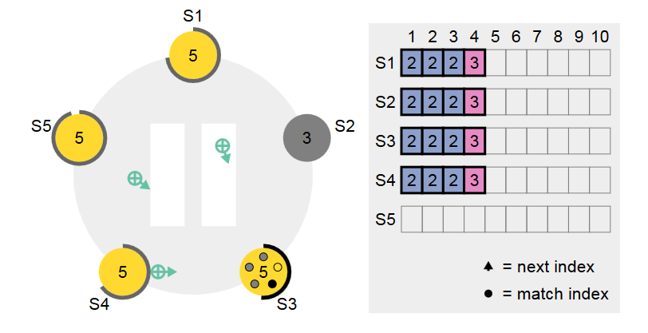

有新的结点计时器到时，然后发起选举，这里S3发起了选举，然后跟之前的步骤一样，使S5状态同步到全局一致。 

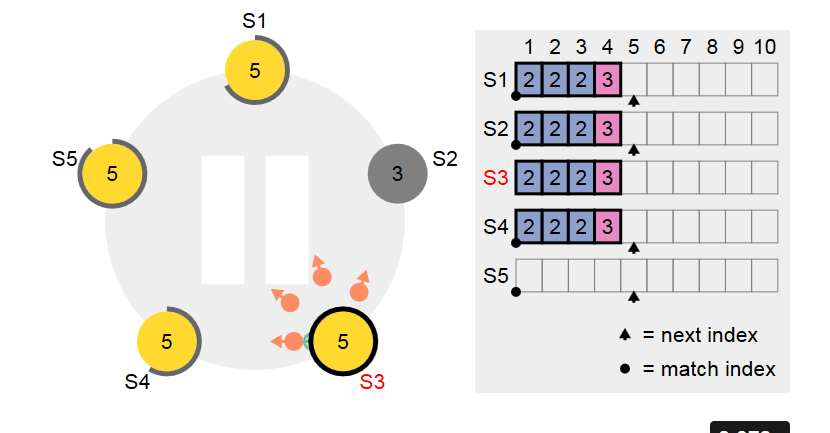

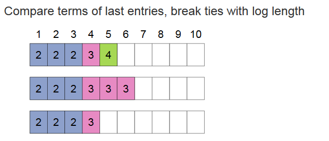

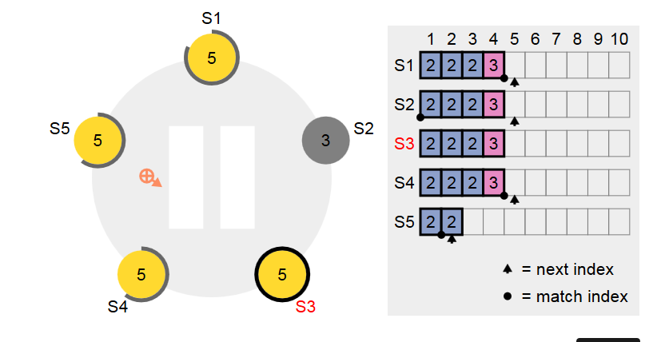

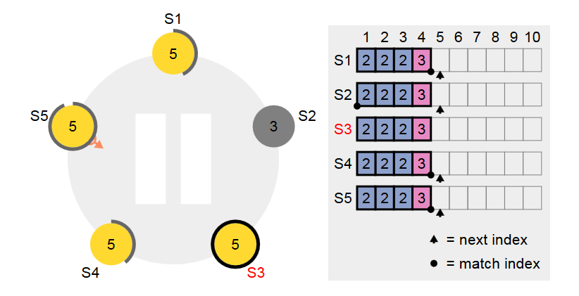