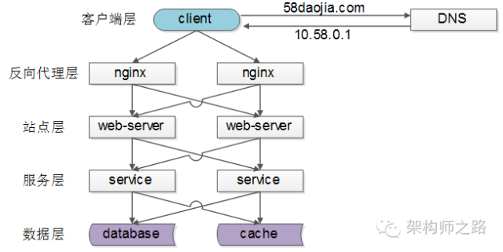
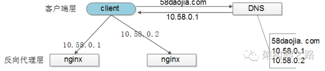
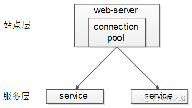
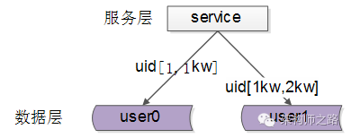
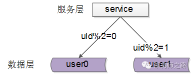

负载均衡

# 什么是负载均衡
http://blog.jobbole.com/97957/
https://zh.wikipedia.org/wiki/%E8%B4%9F%E8%BD%BD%E5%9D%87%E8%A1%A1

面对大量用户访问、高并发请求，海量数据，可以使用高性能的服务器、大型数据库，存储设备，高性能Web服务器，采用高效率的编程语言比如(Go,Scala)等，当单机容量达到极限时，我们需要考虑业务拆分和分布式部署，来解决大型网站访问量大，并发量高，海量数据的问题。

从单机网站到分布式网站，很重要的区别是业务拆分和分布式部署，将应用拆分后，部署到不同的机器上，实现大规模分布式系统。分布式和业务拆分解决了，从集中到分布的问题，但是每个部署的独立业务还存在单点的问题和访问统一入口问题，为解决单点故障，我们可以采取冗余的方式。将相同的应用部署到多台机器上。解决访问统一入口问题，我们可以在集群前面增加负载均衡设备，实现流量分发。

负载均衡（Load Balance），意思是将负载（工作任务，访问请求）进行平衡、分摊到多个操作单元（服务器，组件）上进行执行。是解决高性能，单点故障（高可用），扩展性（水平伸缩）的终极解决方案。

# 原理
系统的扩展可分为纵向（垂直）扩展和横向（水平）扩展。纵向扩展，是从单机的角度通过增加硬件处理能力，比如CPU处理能力，内存容量，磁盘等方面，实现服务器处理能力的提升，不能满足大型分布式系统（网站），大流量，高并发，海量数据的问题。因此需要采用横向扩展的方式，通过添加机器来满足大型网站服务的处理能力。比如：一台机器不能满足，则增加两台或者多台机器，共同承担访问压力。这就是典型的集群和负载均衡架构：如下图：
	
						          +-------------+ 
			+-------------+ ------>   |     应用A   |
			|             |           +-------------+ 
	------>	| 负载均衡器  |
			|             |  		  +-------------+ 
			+-------------+	------>   |     应用B   |
									  +-------------+ 

负载均衡的作用：

1. 解决并发压力，提高应用处理性能（增加吞吐量，加强网络处理能力）；
2. 提供故障转移，实现高可用；
3. 通过添加或减少服务器数量，提供网站伸缩性（扩展性）；
4. 安全防护；（负载均衡设备上做一些过滤，黑白名单等处理）

# 分类、方案

http://mp.weixin.qq.com/s?__biz=MjM5ODYxMDA5OQ==&mid=2651959585&idx=1&sn=0a9222cbfeb62a662edffafb7f0b43ae&mpshare=1&scene=23&srcid=1013qdS0AxLhlFk4XHtm6PCo#rd

## 常见的负载均衡方案

常见互联网分布式架构如上，分为客户端层、反向代理nginx层、站点层、服务层、数据层。可以看到，每一个下游都有多个上游调用，只需要做到，每一个上游都均匀访问每一个下游，就能实现“将请求/数据【均匀】分摊到多个操作单元上执行”

## 【客户端层->反向代理层】的负载均衡

【客户端层】到【反向代理层】的负载均衡，是通过“DNS轮询”实现的：DNS-server对于一个域名配置了多个解析ip，每次DNS解析请求来访问DNS-server，会轮询返回这些ip，保证每个ip的解析概率是相同的。这些ip就是nginx的外网ip，以做到每台nginx的请求分配也是均衡的。

优点

    使用简单：负载均衡工作，交给DNS服务器处理，省掉了负载均衡服务器维护的麻烦
    提高性能：可以支持基于地址的域名解析，解析成距离用户最近的服务器地址，可以加快访问速度，改善性能；

缺点

    可用性差：DNS解析是多级解析，新增/修改DNS后，解析时间较长；解析过程中，用户访问网站将失败；
    扩展性低：DNS负载均衡的控制权在域名商那里，无法对其做更多的改善和扩展；
    维护性差：也不能反映服务器的当前运行状态；支持的算法少；不能区分服务器的差异（不能根据系统与服务的状态来判断负载）

## 【反向代理层->站点层】的负载均衡

【反向代理层】到【站点层】的负载均衡，是通过“nginx”实现的。通过修改nginx.conf，可以实现多种负载均衡策略：

1. 请求轮询：和DNS轮询类似，请求依次路由到各个web-server
2. 最少连接路由：哪个web-server的连接少，路由到哪个web-server
3. ip哈希：按照访问用户的ip哈希值来路由web-server，只要用户的ip分布是均匀的，请求理论上也是均匀的，ip哈希均衡方法可以做到，同一个用户的请求固定落到同一台web-server上，此策略适合有状态服务，例如session（58沈剑备注：可以这么做，但强烈不建议这么做，站点层无状态是分布式架构设计的基本原则之一，session最好放到数据层存储）
4. 加权轮询
5. ...

## 【站点层->服务层】的负载均衡

【站点层】到【服务层】的负载均衡，是通过“服务连接池”实现的。

上游连接池会建立与下游服务多个连接，每次请求会“随机”选取连接来访问下游服务。

## 【数据层】的负载均衡
在数据量很大的情况下，由于数据层（db，cache）涉及数据的水平切分，所以数据层的负载均衡更为复杂一些，它分为“数据的均衡”，与“请求的均衡”。

数据的均衡是指：水平切分后的每个服务（db，cache），数据量是差不多的。

请求的均衡是指：水平切分后的每个服务（db，cache），请求量是差不多的。

业内常见的水平切分方式有这么几种：

一、按照range水平切分

每一个数据服务，存储一定范围的数据，上图为例：

- user0服务，存储uid范围1-1kw
- user1服务，存储uid范围1kw-2kw

这个方案的好处是：

1. 规则简单，service只需判断一下uid范围就能路由到对应的存储服务
2. 数据均衡性较好
3. 比较容易扩展，可以随时加一个uid[2kw,3kw]的数据服务

不足是：

1. 请求的负载不一定均衡，一般来说，新注册的用户会比老用户更活跃，大range的服务请求压力会更大

二、按照id哈希水平切分

每一个数据服务，存储某个key值hash后的部分数据，上图为例：

- user0服务，存储偶数uid数据
- user1服务，存储奇数uid数据

这个方案的好处是：

1. 规则简单，service只需对uid进行hash能路由到对应的存储服务
2. 数据均衡性较好
3. 请求均匀性较好

不足是：

1. 不容易扩展，扩展一个数据服务，hash方法改变时候，可能需要进行数据迁移

**总结**

负载均衡（Load Balance）是分布式系统架构设计中必须考虑的因素之一，它通常是指，将请求/数据【均匀】分摊到多个操作单元上执行，负载均衡的关键在于【均匀】。

1. 【客户端层】到【反向代理层】的负载均衡，是通过“DNS轮询”实现的
2. 【反向代理层】到【站点层】的负载均衡，是通过“nginx”实现的
3. 【站点层】到【服务层】的负载均衡，是通过“服务连接池”实现的
4. 【数据层】的负载均衡，要考虑“数据的均衡”与“请求的均衡”两个点，常见的方式有“按照范围水平切分”与“hash水平切分”

# 算法
当前，负载均衡器有各种各样的工作调度算法（用于决定将前端用户请求发送到哪一个后台服务器），最简单的是随机选择和轮询。更为高级的负载均衡器会考虑其它更多的相关因素，如后台服务器的负载，响应时间，运行状态，活动连接数，地理位置，处理能力，或最近分配的流量。

http://www.codeceo.com/article/balanced-algorithm.html

## 随机(Random)
这种方法会将收到的请求随机分配到服务器集群中的每台机器

## 轮循(Round Robin)

这种方法会将收到的请求循环分配到服务器集群中的每台机器，即有效服务器。如果使用这种方式，所有的标记进入虚拟服务的服务器应该有相近的资源容量以及负载形同的应用程序。如果所有的服务器有相同或者相近的性能那么选择这种方式会使服务器负载形同。基于这个前提，轮循调度是一个简单而有效的分配请求的方式。然而对于服务器不同的情况，选择这种方式就意味着能力比较弱的服务器也会在下一轮循环中接受轮循，即使这个服务器已经不能再处理当前这个请求了。这可能导致能力较弱的服务器超载

## 加权轮循(Weighted Round Robin)

这种算法解决了简单轮循调度算法的缺点：传入的请求按顺序被分配到集群中服务器，但是会考虑提前为每台服务器分配的权重。管理员只是简单的通过服务器的处理能力来定义各台服务器的权重。例如，能力最强的服务器A给的权重是100，同时能力最低的服务器给的权重是50。这意味着在服务器B接收到第一个请求之前前，服务器A会连续的接受到2个请求，以此类推。

## 最少连接数(Least Connection)

以上两种方法都没有考虑的是系统不能识别在给定的时间里保持了多少连接。因此可能发生，服务器B收到的连接比服务器A少但是它已经超载，因为服务器B上的用户打开连接持续的时间更长。这就是说连接数即服务器的负载是累加的。这种潜在的问题可以通过“最少连接数”算法来避免：传入的请求是根据每台服务器当前所打开的连接数来分配的。即活跃连接数最少的服务器会自动接收下一个传入的请求。基本上和简单轮询的原则相同：所有拥有虚拟服务的服务器资源容量应该相近。值得注意的是，在流量率低的配置环境中，各服务器的流量并不是相同的，会优先考虑第一台服务器。这是因为，如果所有的服务器是相同的，那么第一个服务器优先，直到第一台服务器有连续的活跃流量，否则总是会优先选择第一台服务器。

## 加权最少连接(Weighted Least Connection)

如果服务器的资源容量各不相同，那么“加权最少连接”方法更合适：由管理员根据服务器情况定制的权重所决定的活跃连接数一般提供了一种对服务器非常平衡的利用，因为他它借鉴了最少连接和权重两者的优势。通常，这是一个非常公平的分配方式，因为它使用了连接数和服务器权重比例;集群中比例最低的服务器自动接收下一个请求。但是请注意，在低流量情况中使用这种方法时，请参考“最小连接数”方法中的注意事项。

## 最少连接数慢启动时间(Least Connection Slow Start Time)

对最少连接数和带权重的最小连接数调度方法来说，当一个服务器刚加入线上环境是，可以为其配置一个时间段，在这段时间内连接数是有限制的而且是缓慢增加的。这为服务器提供了一个‘过渡时间’以保证这个服务器不会因为刚启动后因为分配的连接数过多而超载。

## 基于代理的自适应负载均衡(Agent Based Adaptive Balancing)

除了上述方法之外，负载主机包含一个自适用逻辑用来定时监测服务器状态和该服务器的权重。对于非常强大的“基于代理的自适应负载均衡”方法来说，负载主机以这种方式来定时检测所有服务器负载情况：每台服务器都必须提供一个包含文件，这个文件包含一个0~99的数字用来标明改服务器的实际负载情况(0=空前，99=超载，101=失败，102=管理员禁用)，而服务器同构http get方法来获取这个文件;同时对集群中服务器来说，以二进制文件形式提供自身负载情况也是该服务器工作之一，然而，并没有限制服务器如何计算自身的负载情况。根据服务器整体负载情况，有两种策略可以选择：在常规的操作中，调度算法通过收集的服务器负载值和分配给该服务器的连接数的比例计算出一个权重比例。因此，如果一个服务器负载过大，权重会通过系统透明的作重新调整。和加权轮循调度方法一样，不正确的分配可以被记录下来使得可以有效的为不同服务器分配不同的权重。然而，在流量非常低的环境下，服务器报上来的负载值将不能建立一个有代表性的样本;那么基于这些值来分配负载的话将导致失控以及指令震荡。因此，在这种情况下更合理的做法是基于静态的权重比来计算负载分配。当所有服务器的负载低于管理员定义的下限时，负载主机就会自动切换为加权轮循方式来分配请求;如果负载大于管理员定义的下限，那么负载主机又会切换回自适应方式。

## 固定权重(Fixed Weighted)

最高权重只有在其他服务器的权重值都很低时才使用。然而，如果最高权重的服务器下降，则下一个最高优先级的服务器将为客户端服务。这种方式中每个真实服务器的权重需要基于服务器优先级来配置。

## 加权响应(Weighted Response)

流量的调度是通过加权轮循方式。加权轮循中所使用的权重是根据服务器有效性检测的响应时间来计算。每个有效性检测都会被计时，用来标记它响应成功花了多长时间。但是需要注意的是，这种方式假定服务器心跳检测是基于机器的快慢，但是这种假设也许不总是能够成立。所有服务器在虚拟服务上的响应时间的总和加在一起，通过这个值来计算单个服务物理服务器的权重;这个权重值大约每15秒计算一次。

## 源IP哈希(Source IP Hash)

这种方式通过生成请求源IP的哈希值，并通过这个哈希值来找到正确的真实服务器。这意味着对于同一主机来说他对应的服务器总是相同。使用这种方式，你不需要保存任何源IP。但是需要注意，这种方式可能导致服务器负载不平衡。

# 服务层的负载均衡（权重）
http://mp.weixin.qq.com/s?__biz=MjM5ODYxMDA5OQ==&mid=2651959601&idx=1&sn=5684c39676b1f6d9366d9d15a2cdcec3&mpshare=1&scene=23&srcid=1013AlWoQKC6fgqpYeAsXnOl#rd

后端的service有可能部署在硬件条件不同的服务器上：

1. 如果对标最低配的服务器“均匀”分摊负载，高配的服务器的利用率不足；
2. 如果对标最高配的服务器“均匀”分摊负载，低配的服务器可能会扛不住；

## 静态权重

调用方通过连接池组件访问下游service，通常采用“随机”的方式返回连接，以保证下游service访问的均衡性。

要打破这个随机性，最容易想到的方法，只要为每个下游service设置一个“权重”，代表service的处理能力，来调整访问到每个service的概率，例如：

假设service-ip1，service-ip2，service-ip3的处理能力相同，可以设置weight1=1，weight2=1，weight3=1，这样三个service连接被获取到的概率分别就是1/3，1/3，1/3，能够保证均衡访问。

假设service-ip1的处理能力是service-ip2，service-ip3的处理能力的2倍，可以设置weight1=2，weight2=1，weight3=1，这样三个service连接被获取到的概率分别就是2/4，1/4，1/4，能够保证处理能力强的service分别到等比的流量，不至于资源浪费。

使用nginx做反向代理与负载均衡，就有类似的机制。

这个方案的优点是：简单，能够快速的实现异构服务器的负载均衡。

缺点也很明显：这个权重是固定的，无法自适应动态调整，而很多时候，服务器的处理能力是很难用一个固定的数值量化。

## 动态权重

提问：通过什么来标识一个service的处理能力呢？

回答：其实一个service能不能处理得过来，能不能响应得过来，应该由调用方说了算。调用服务，快速处理了，处理能力跟得上；调用服务，处理超时了，处理能力很有可能跟不上了。

动态权重设计

1. 用一个动态权重来标识每个service的处理能力，默认初始处理能力相同，即分配给每个service的概率相等；
2. 每当service成功处理一个请求，认为service处理能力足够，权重动态+1
3. 每当service超时处理一个请求，认为service处理能力可能要跟不上了，权重动态-10（权重下降会更快）
4. 为了方便权重的处理，可以把权重的范围限定为[0, 100]，把权重的初始值设为60分

举例说明：

假设service-ip1，service-ip2，service-ip3的动态权重初始值weight1=weight2=weight3=60，刚开始时，请求分配给这3台service的概率分别是60/180，60/180，60/180，即负载是均衡的。

随着时间的推移，处理能力强的service成功处理的请求越来越多，处理能力弱的service偶尔有超时，随着动态权重的增减，权重可能变化成了weight1=100，weight2=60，weight3=40，那么此时，请求分配给这3台service的概率分别是100/200，60/200，40/200，即处理能力强的service会被分配到更多的流量。

## 过载保护
提问：什么是过载保护？

回答：互联网软件架构设计中所指的过载保护，是指当系统负载超过一个service的处理能力时，如果service不进行自我保护，可能导致对外呈现处理能力为0，且不能自动恢复的现象。而service的过载保护，是指即使系统负载超过一个service的处理能力，service让能保证对外提供有损的稳定服务。

提问：如何进行过载保护？

回答：最简易的方式，服务端设定一个负载阈值，超过这个阈值的请求压过来，全部抛弃。这个方式不是特别优雅。

## 动态权重的过载保护

动态权重是用来标识每个service的处理能力的一个值，它是RPC-client客户端连接池层面的一个东东。服务端处理超时，客户端RPC-client连接池都能够知道，这里只要实施一些策略，就能够对“疑似过载”的服务器进行降压，而不用服务器“抛弃请求”这么粗暴的实施过载保护。

应该实施一些什么样的策略呢，例如：

1. 如果某一个service的连接上，连续3个请求都超时，即连续-10分三次，客户端就可以认为，服务器慢慢的要处理不过来了，得给这个service缓一小口气，于是设定策略：接下来的若干时间内，例如1秒（或者接下来的若干个请求），请求不再分配给这个service；
2. 如果某一个service的动态权重，降为了0（像连续10个请求超时，中间休息了3次还超时），客户端就可以认为，服务器完全处理不过来了，得给这个service喘一大口气，于是设定策略：接下来的若干时间内，例如1分钟（为什么是1分钟，根据经验，此时service一般在发生fullGC，差不多1分钟能回过神来），请求不再分配给这个service；
3. 可以有更复杂的保护策略…

**其实就是断路器的实现**

这样的话，不但能借助“动态权重”来实施动态自适应的异构服务器负载均衡，还能在客户端层面更优雅的实施过载保护，在某个下游service快要响应不过来的时候，给其喘息的机会。

需要注意的是：要防止客户端的过载保护引起service的雪崩，如果“整体负载”已经超过了“service集群”的处理能力，怎么转移请求也是处理不过来的，还得通过抛弃请求来实施自我保护。

总结

1. service的负载均衡、故障转移、超时处理通常是RPC-client连接池层面来实施的
2. 异构服务器负载均衡，最简单的方式是静态权重法，缺点是无法自适应动态调整
3. 动态权重法，可以动态的根据service的处理能力来分配负载，需要有连接池层面的微小改动
4. 过载保护，是在负载过高时，service为了保护自己，保证一定处理能力的一种自救方法
5. 动态权重法，还可以用做service的过载保护