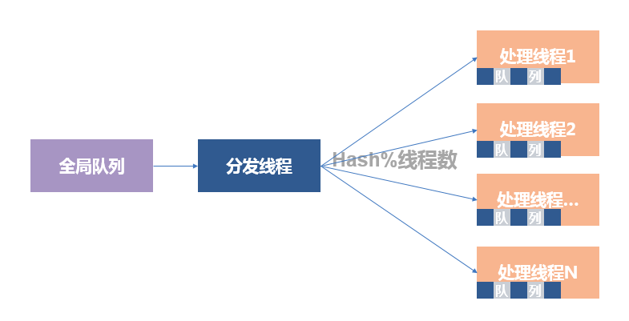
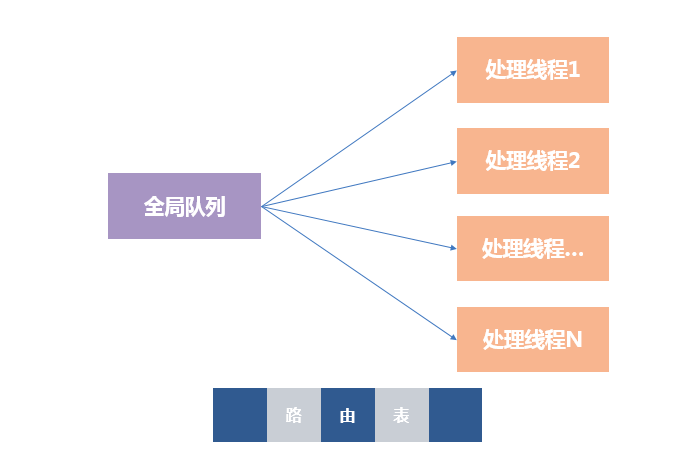

http://www.bitstech.net/2013/08/23/messagequeue/

# 如何保证同一用户的消息按序处理

消息队列是应用开发的常用工具, 也是系统解耦的必备利器。保证同一用户的消息按照顺序处理是应用的常见需求，  譬如在微博应用中， 发表微博、删除微博这两个操作必须按序处理，乱序势必造成业务逻辑错误。

如何保证消息处理顺序？以下是常见的几种做法。
**设计一**： 单线程处理。 虽然单线程处理非常简单好用，但是单线程限制了系统吞吐率。

**设计二**： 每个用户一个队列。看起来很美，实际上基本不可行。首先，每个消息队列基本都没啥消息， 其次， 不可能为每个用户安排一个线程。

**设计三**：  静态消息分发。系统设计分发线程和工作线程，每工作线程设置一个线程私有的消息队列，工作线程从私有消息队列取消息，执行业务逻辑。假定工作线程个数为N,  分发线程从全局的消息队列取消息，推消息到第 Hash(用户名）%N个线程私有队列。  静态消息分发一般来说够用，但也存在一些弱点。 首先存在伪冲突，隶属于同一个私有队列的消息按序处理，慢消息将阻塞私有队列中的后续消息，所以无法适用于实时性要求较高的应用。 其次，全局阻塞问题。线程私有队列慢时，分发线程停顿 ，造成全局停顿，几乎无法接受。

**设计四**： 动态路由消息队列。 设计一种新的消息队列，支持以下功能：（1）路由。工作线程取消息时，只能取出不在路由表中的消息， 取出消息之后，登记到路由表。（2）ACK。工作线程处理完消息之后， 调用ACK接口，消息队列删除消息，并清理路由表。从动态路由消息队列取消息，即不存在为冲突，也不存在全局阻塞， 恰好能解决问题。

