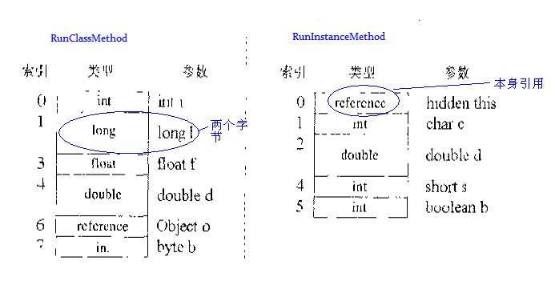
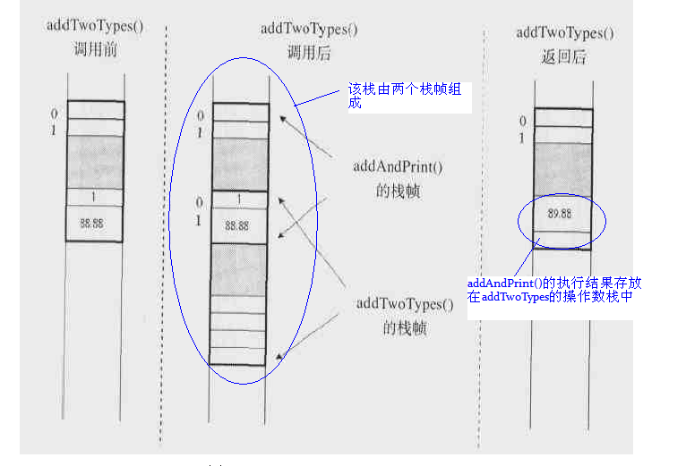

https://iamjohnnyzhuang.github.io/java/2016/07/12/Java%E5%A0%86%E5%92%8C%E6%A0%88%E7%9C%8B%E8%BF%99%E7%AF%87%E5%B0%B1%E5%A4%9F.html

栈帧由三部分组成：局部变量区、操作数栈、帧数据区。局部变量区和操作数栈的大小要视对应的方法而定，他们是按字长计算的。但调用一个方法时，它从类型信息中得到此方法局部变量区和操作数栈大小，并据此分配栈内存，然后压入Java栈 

**局部变量区**

局部变量区被组织为以一个字长为单位、从0开始计数的数组，类型为short、byte和char的值在存入数组前要被转换成int值，而long和double在数组中占据连续的两项，在访问局部变量中的long或double时，只需取出连续两项的第一项的索引值即可,如某个long值在局部变量区中占据的索引时3、4项，取值时，指令只需取索引为3的long值即可。

```
public static int runClassMethod(int i,long l,float f,double d,Object o,byte b) { 
   return 0;   
}

public int runInstanceMethod(char c,double d,short s,boolean b) { 
       return 0;   
}
```



**操作数栈** 

和局部变量区一样，操作数栈也被组织成一个以字长为单位的数组。但和前者不同的是，它不是通过索引来访问的，而是通过入栈和出栈来访问的。可把操作数栈理解为存储计算时，临时数据的存储区域。下面我们通过一段简短的程序片段外加一幅图片来了解下操作数栈的作用。

```
int a = 1;
int b = 98;
int c = a+b;	
```


从图中可以得出：操作数栈其实就是个临时数据存储区域，它是通过入栈和出栈来进行操作的。 

**帧数据区**   

除了局部变量区和操作数栈外，java栈帧还需要一些数据来支持常量池解析、正常方法返回以及异常派发机制。这些数据都保存在java栈帧的帧数据区中。

当JVM执行到需要常量池数据的指令时，它都会通过帧数据区中指向常量池的指针来访问它。

 除了处理常量池解析外，帧里的数据还要处理java方法的正常结束和异常终止。如果是通过return正常结束，则当前栈帧从Java栈中弹出，恢复发起调用的方法的栈。如果方法又返回值，JVM会把返回值压入到发起调用方法的操作数栈。

为了处理java方法中的异常情况，帧数据区还必须保存一个对此方法异常引用表的引用。当异常抛出时，JVM给catch块中的代码。如果没发现，方法立即终止，然后JVM用帧区数据的信息恢复发起调用的方法的帧。然后再发起调用方法的上下文重新抛出同样的异常。

**栈的整个结构**

在前面就描述过：栈是由栈帧组成，每当线程调用一个java方法时，JVM就会在该线程对应的栈中压入一个帧，而帧是由局部变量区、操作数栈和帧数据区组成。那在一个代码块中，栈到底是什么形式呢？下面是我从《深入JVM》中摘抄的一个例子，大家可以看看：

```
public class Main{    
	public static void addAndPrint(){      
    	double result = addTwoTypes(1,88.88);    
        System.out.println(result);    
    }   
         
    public static double addTwoTypes(int i,double d){  
    	return i + d;  
    }
}
```



上面所给的图，只想说明两件事情：

1. 只有在调用一个方法时，才为当前栈分配一个帧，然后将该帧压入栈
2. 帧中存储了对应方法的局部数据，方法执行完，对应的帧则从栈中弹出，并把返回结果存储在**调用 方法的帧的操作数栈中**


# 常见误区

## 一、Java中的基本数据类型一定存储在栈中吗？

不一定。栈内存用来存储局部变量和方法调用。

如果该局部变量是基本数据类型例如

```
int a = 1;
```

那么直接将该值存储在栈中。

如果该局部变量是一个对象如

```
int[] array=new int[]{1,2};
```

那么将引用存在栈中而对象({1,2})存储在堆内。