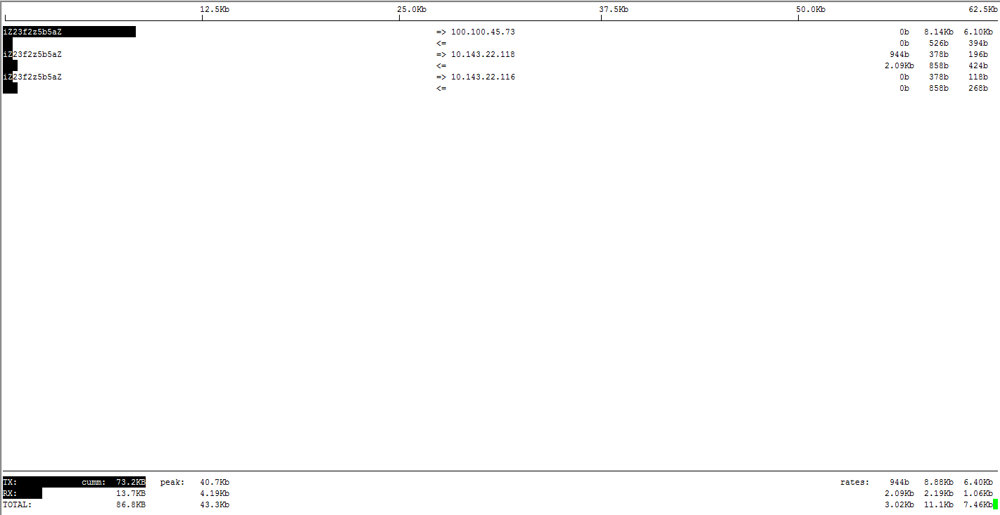
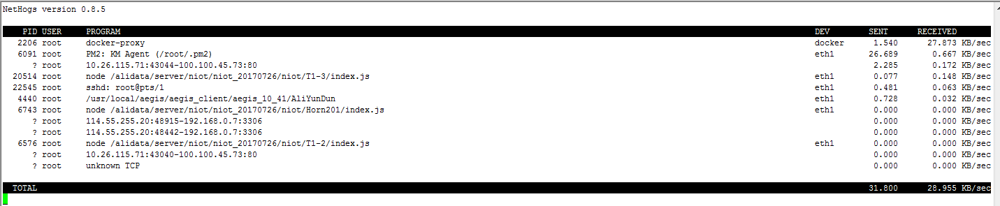

# iftop

查看实时的网络流量，监控TCP/IP连接

https://www.vpser.net/manage/iftop.html

http://kodango.com/using-iftop-to-monitor-network

## 安装

```
#centos
yum install iftop -y
#ubuntu
apt-get install iftop
```

## 运行

```
iftop
```

效果图

```
[root]# iftop
interface: eth0
IP address is: 10.45.55.10
MAC address is: 00:16:3e:01:13:d1  

```



### 显示结果

在命令行中执行之后，会显示抓取的网络连接列表，以及对应的网络流量统计。每个连接显示结果类似：

```
foo.example.com  =>  bar.example.com      1Kb  500b   100b
                 <=                       2Mb  2Mb    2Mb 
```

两行分别表示不同的数据传输方向，对于第一行而言，第一列是源地址，第二列是目的地址，最后三列分别是最近 2 秒、10 秒、40 秒发送的平均网络流量。默认情况下，是按十秒内的平均网络流量排序的。

底部会显示一些全局的统计数据，peek 是指峰值情况，cumm 是从运行至今的累计情况，而 rates 表示最近 2 秒、10 秒、40 秒内总共接收或者发送的平均网络流量。TX是发送流量、RX是接收流量、total是总流量

```
TX:  cumm:   143MB   peak:   10.5Mb    rates:   1.03Mb  1.54Mb  2.10Mb
RX:          12.7GB          228Mb              189Mb   191Mb   183Mb
TOTAL:       12.9GB          229Mb              190Mb   193Mb   185MbW
```

## 常用参数

-i 设定监测的网卡，如：# iftop -i eth1

-B 以bytes为单位显示流量(默认是bits)，如：# iftop -B

-n 使host信息默认直接都显示IP，如：# iftop -n

-N 使端口信息默认直接都显示端口号，如: # iftop -N

-F 显示特定网段的进出流量，如# iftop -F 10.10.1.0/24或# iftop -F 10.10.1.0/255.255.255.0

-h 帮助，显示参数信息

-p 使用这个参数后，中间的列表显示的本地主机信息，出现了本机以外的IP信息;

-b 使流量图形条默认就显示;

-f 过滤计算包用的;

-P 使host信息及端口信息默认就都显示;

-m 设置界面最上边的刻度的最大值，刻度分五个大段显示，例：# iftop -m 100M

## 常用操作命令 

按 h 切换是否显示帮助;

按 n 切换显示本机的IP或主机名;

按 s 切换是否显示本机的host信息;

按 d 切换是否显示远端目标主机的host信息;

按 t 切换显示格式为2行/1行/只显示发送流量/只显示接收流量;

按 N 切换显示端口号或端口服务名称;

按 S 切换是否显示本机的端口信息;

按 D 切换是否显示远端目标主机的端口信息;

按 p 切换是否显示端口信息;

按 P 切换暂停/继续显示;

按 b 切换是否显示平均流量图形条;

按 B 切换计算2秒或10秒或40秒内的平均流量;

按 T 切换是否显示每个连接的总流量;

按 l 打开屏幕过滤功能，输入要过滤的字符，比如ip,按回车后，屏幕就只显示这个IP相关的流量信息;

按 L 切换显示画面上边的刻度;刻度不同，流量图形条会有变化;

按 j 或按 k 可以向上或向下滚动屏幕显示的连接记录;

按 1 或 2 或 3 可以根据右侧显示的三列流量数据进行排序;

按 < 根据左边的本机名或IP排序; 按 > 根据远端目标主机的主机名或IP排序;

按 o 切换是否固定只显示当前的连接;

按 f 可以编辑过滤代码;

按 ! 可以使用shell命令;

按 q 退出监控。

### 使用例子

现在我们要找出系统中下载最猛的连接，假设网卡为 eth0（私网）：

```
# iftop -i eth0 -nP
```

通过执行一下操作，切换到最适合观察的显示结果：

1. 按下 t 切换显示模式，切换到只显示接收流量（Received traffic only）；
2. 按下 T 显示每个连接的累计总流量（Show cummulative totals）；
3. 按下 3 按最近 40 秒的平均网络流量排序（Sort by col 3）；
4. 按下 B 切换 bar graph 显示为最近 40 秒的平均网络流量（Bars show 40s average），便于观察；

# vnstat

http://tinylab.org/compare-different-vnstat-frontend/

[vnStat](http://humdi.net/vnstat/) 是一款轻量级的网络流量监控工具，目前各大 Linux/BSD 系统都已内置支持。

vnStat 本身只支持命令行的交互方式，而 Web 前端则由第三方工具支持。

## 安装

```
yum install vnstat

apt-get install vnstat
```

### vnstat基本使用命令

```
$ vnstat --help
 vnStat 1.18 by Teemu Toivola

         -q,  --query          query database
         -h,  --hours          show hours
         -d,  --days           show days
         -m,  --months         show months
         -w,  --weeks          show weeks
         -t,  --top10          show top10
         -s,  --short          use short output
         -u,  --update         update database
         -i,  --iface          select interface (default: eth0)
         -?,  --help           short help
         -v,  --version        show version
         -tr, --traffic        calculate traffic
         -ru, --rateunit       swap configured rate unit
         -l,  --live           show transfer rate in real time

See also "--longhelp" for complete options list and "man vnstat".
```

vnstat -i eth0 -l #实时流量情况
vnstat -i eth0 -h #按小时查询流量情况
vnstat -i eth0 -d #按天数查询流量情况
vnstat -i eth0 -m #按月数查询流量情况
vnstat -i eth0 -w #按周数查询流量情况
vnstat -i eth0 -t #查询TOP10流量情况

```
[root@ihorn-dev ~]# vnstat -i eth0 -l
Monitoring eth0...    (press CTRL-C to stop)

   rx:        0 kbit/s     0 p/s          tx:        0 kbit/s     0 p/s^C


 eth0  /  traffic statistics

                           rx         |       tx
--------------------------------------+------------------
  bytes                        5 KiB  |          34 KiB
--------------------------------------+------------------
          max               6 kbit/s  |       46 kbit/s
      average            1.02 kbit/s  |     7.19 kbit/s
          min               0 kbit/s  |        0 kbit/s
--------------------------------------+------------------
  packets                         55  |              39
--------------------------------------+------------------
          max                  8 p/s  |           6 p/s
      average                  1 p/s  |           1 p/s
          min                  0 p/s  |           0 p/s
--------------------------------------+------------------
  time                    38 seconds
```

# **nethogs** 

https://www.vpser.net/manage/nethogs.html

## 安装

```
apt-get install nethogs

yum install nethogs
```

```
[root]# nethogs -h
usage: nethogs [-V] [-h] [-b] [-d seconds] [-v mode] [-c count] [-t] [-p] [-s] [device [device [device ...]]]
		-V : prints version.
		-h : prints this help.
		-b : bughunt mode - implies tracemode.  //bughunt模式
		-d : delay for update refresh rate in seconds. default is 1. //延迟刷新时间，单位秒，默认1秒
		-v : view mode (0 = KB/s, 1 = total KB, 2 = total B, 3 = total MB). default is 0.
		-c : number of updates. default is 0 (unlimited).
		-t : tracemode. //跟踪模式
		-p : sniff in promiscious mode (not recommended). //混合模式下嗅探，不推荐
		-s : sort output by sent column.
   -a : monitor all devices, even loopback/stopped ones.
		device : device(s) to monitor. default is all interfaces up and running excluding loopback //监听的设备，默认是eth0，也就是网卡设备名称，如果是openvz的vps一般都是venet0，具体可以ifconfig进行查看，lo为本地回环，用不到。多个网卡可以一块写上，空格隔开

When nethogs is running, press:
 q: quit
 s: sort by SENT traffic
 r: sort by RECEIVE traffic
 m: switch between total (KB, B, MB) and KB/s mode
```

PID一列就是进程的PID

PROGRAM就是显示进程或连接双方的端口号，前面是客户端的IP:端口，后面是当前服务器上的IP:端口，如图根据端口可以判断，目前有80端口，如果不知道端口对应的进程可以通过lsof来进行查看。

DEV列显示设备名，

SEND列相当于服务器往外流出占用的带宽

RECEIVED相当于在服务上使用wget下载时占用的带宽