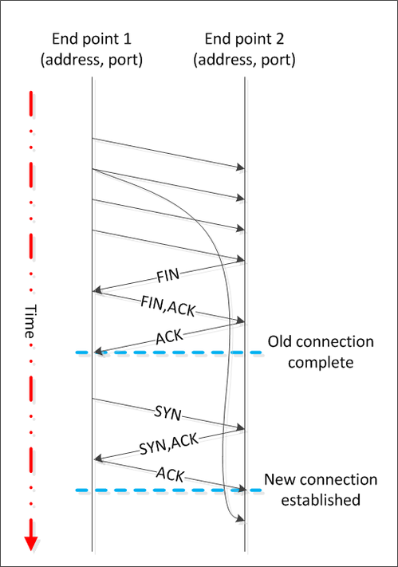

time_wait close_wait

https://huoding.com/2013/12/31/316

http://www.cnblogs.com/sunxucool/p/3449068.html

http://www.firefoxbug.com/index.php/archives/2795/

在服务器的日常维护过程中，会经常用到下面的命令：

    netstat -n | awk '/^tcp/ {++S[$NF]} END {for(a in S) print a, S[a]}' 

输出

	SYN_RECV 1
	CLOSE_WAIT 1
	ESTABLISHED 505
	FIN_WAIT2 4
	TIME_WAIT 9

或者

	ss -ant | awk 'NR>1 {++s[$1]} END {for(k in s) print k,s[k]}'

常用的三个状态是：ESTABLISHED 表示正在通信，TIME_WAIT 表示主动关闭，CLOSE_WAIT 表示被动关闭。

# 为什么会存在TIME_WAIT？

TCP在建立连接的时候需要握手，同理，在关闭连接的时候也需要握手。为了更直观的说明关闭连接时握手的过程

因为TCP连接是双向的，所以在关闭连接的时候，两个方向各自都需要关闭。先发FIN包的一方执行的是主动关闭；后发FIN包的一方执行的是被动关闭。主动关闭的一方会进入TIME_WAIT状态，并且在此状态停留两倍的MSL时长。

1. client: 主动调用close()，发送 FIN 包，此时client就"主动关闭"端，进入 FIN_WAIT_1 状态；
2. Server: server自然成为"被动关闭"端，收到来自client的 FIN 包，发送 ACK 包，代表client->server单向tcp连接已经关闭，进入 CLOSE_WAIT 状态；
3. Client: 接收到来自server的 ACK 包，啥都不做，client->server单向的tcp连接已经断开，不能再发送应用层数据，进入 FIN_WAIT_2 状态；
4. Server: server端给client端发送 FIN 包，代表准备关闭server->client的tcp连接，server进入LAST_ACK 状态；
5. Client: 收到来自server的 FIN 包，发送 ACK 包，此时进入 TIME_WAIT 状态；
6. Server: 收到Client的 ACK 包，就进入closed状态，Server端此次socket tcp连接完全关闭；
7. Client: 持续TIME_WAIT状态"一段时间"；

**什么是MSL**
MSL指的是数据包的最大生存时间，如果数据包在网络生存的时间超过了MSL时间，还没有被接收，那么会被丢弃。关于MSL的大小，RFC 793协议中给出的建议是两分钟，不过实际上不同的操作系统可能有不同的设置，以Linux为例，通常是半分钟，两倍的MSL就是一分钟，也就是60秒，并且这个数值是硬编码在内核中的，也就是说除非你重新编译内核，否则没法修改它

如果每秒的连接数是一千的话，那么一分钟就可能会产生六万个TIME_WAIT。

# 为什么要有TIME_WAIT
TIME_WAIT是“主动关闭”端的最后一个状态，引入TIME_WAIT的原因有:

1. 确保"主动关闭"端最后发出的 ACK 到达"被动关闭"端
2. 保证新tcp连接和老tcp连接不会干扰

## 原因1: 确保"主动关闭"端最后发出的 ACK 到达"被动关闭"端

看上面tcp断开连接的图，由client主动调用close()，发出FIN包，然后接收到server的ACK/FIN包，客户端最后发一个FIN包，进入TIME_WAIT。

设想一下，如果没有TIME_WAIT，client端发送最后的FIN包后里面关闭连接，如果由于网络原因，最后发出的FIN包没有顺利到达server(此时的server一直处于LAST_ACK状态等待最后FIN)，server长时间没有接收到FIN包，会认为之前由server发出的ACK/FIN包client没有收到，server会重新发送一个ACK/FIN包，这时候client收到ACK/FIN包，发现端口已经关闭，协议栈直接回复RST包，导致server端接收到RST包报错，影响应用进程。

所以 TIME_WAIT 的作用可以保证最后的ACK包必然能到达对方，确保最后的连接正常端口。也解释了TIME_WAIT时间是2*MSL的原因。

## 原因2: 保证新tcp连接和老tcp连接不会干扰

End Point2发送FIN包后，没有进入TIME_WAIT状态，此时新的tcp请求又来了，而且src_ip，src_port，dst_ip，dst_port都是一样的，新的连接建立TCP请求后，老的连接包可能会干扰新连接的包，导致乱序。所以引入TIME_WAIT，2*MSL能让老连接的包彻底在网络中消失，保证新连接绝对干净。

# TIME_WAIT数量多？

TIME_WAIT是占资源的，包括端口资源，协议栈队列，所以大量的TIME_WAIT会影响socket建立新连接，这点特别在高性能的Web服务器中很讲究，那么有办法去减少TIME_WAIT数量吗？嘿嘿，看了上面TIME_WAIT存在的原因后，还想去调整tcp_tw_recycle或者tcp_tw_reuse等参数吗？这很有可能会引发未知的TCP错误，而且很诡异，很难排查。所以在高性能的Web服务器里面，必然会去设置HTTP的KeepAlive，不然Web服务器立马就被大量的TIME_WAIT影响服务。
调整TIME_WAIT数量

要调整TIME_WAIT的数量，网上都是这几个参数，要修改的话还是悠着点吧？

	net.ipv4.tcp_tw_reuse = 0 表示开启重用。允许将TIME-WAIT sockets重新用于新的TCP连接，默认为0，表示关闭；打开tcp_tw_reuse的时候要注意，是客户端还是服务端，如果是
	net.ipv4.tcp_tw_recycle = 0  表示开启TCP连接中TIME-WAIT sockets的快速回收，默认为0，表示关闭。
	net.ipv4.tcp_fin_timeout = 30  表示如果套接字由本端要求关闭，这个参数决定了它保持在FIN-WAIT-2状态的时间。
	net.ipv4.tcp_tw_timeout = 15 标识TIME_WAIT的回收时间。

**tcp_tw_recycle**
回收TIME_WAIT连接

tcp_tw_recycle必须和tcp_timestamps一起打开，默认情况linux的tcp_timestamps都是打开的，tcp_tw_recycle到底是多久回收sockets？正常是700ms。

tcp_tw_recycle的坑：当多个客户端通过NAT方式联网并与服务端交互时，服务端看到的是同一个IP，也就是说对服务端而言这些客户端实际上等同于一个，可惜由于这些客户端的时间戳可能存在差异，于是乎从服务端的视角看，便可能出现时间戳错乱的现象，进而直接导致时间戳小的数据包被丢弃

注意：在NAT模型中，tcp_tw_recycle打开可能会导致丢包

**tcp_tw_reuse**
复用TIME_WAIT连接

tcp_tw_reuse选项和tcp_timestamps选项也必须同时打开；
重用TIME_WAIT的条件是收到最后一个包后超过1s

**tcp_max_tw_buckets**
控制TIME_WAIT总数。

官网文档说这个选项只是为了阻止一些简单的DoS攻击，平常不要人为的降低它。如果缩小了它，那么系统会将多余的TIME_WAIT删除掉，日志里会显示：「TCP: time wait bucket table overflow」。

# HTTP

客户端向服务端发起HTTP请求，服务端响应后主动关闭连接，于是TIME_WAIT便留在了服务端。这里的关键在于主动关闭连接的是服务端！如果客户端可控的话，那么在服务端打开KeepAlive，尽可能不让服务端主动关闭连接，而让客户端主动关闭连接，如此一来问题便迎刃而解了。

在HTTP1.1协议中，有个 Connection 头，Connection有两个值，close和keep-alive，这个头就相当于客户端告诉服务端，服务端你执行完成请求之后，是关闭连接还是保持连接，保持连接就意味着在保持连接期间，只能由客户端主动断开连接。还有一个keep-alive的头，设置的值就代表了服务端保持连接保持多久。

HTTP默认的Connection值为close，那么就意味着关闭请求的一方几乎都会是由服务端这边发起的。那么这个服务端产生TIME_WAIT过多的情况就很正常了。

虽然HTTP默认Connection值为close，但是现在的浏览器发送请求的时候一般都会设置Connection为keep-alive了。所以，也有人说，现在没有必要通过调整参数来使TIME_WAIT降低了。

# CLOSE_WAIT

https://huoding.com/2016/01/19/488
https://mp.weixin.qq.com/s?__biz=MzI4MjA4ODU0Ng==&mid=402163560&idx=1&sn=5269044286ce1d142cca1b5fed3efab1&3rd=MzA3MDU4NTYzMw==&scene=6#rd

通常，CLOSE_WAIT 状态在服务器停留时间很短，如果你发现大量的 CLOSE_WAIT 状态，那么就意味着被动关闭的一方没有及时发出 FIN 包，一般有如下几种可能：

    程序问题：如果代码层面忘记了 close 相应的 socket 连接，那么自然不会发出 FIN 包，从而导致 CLOSE_WAIT 累积；或者代码不严谨，出现死循环之类的问题，导致即便后面写了 close 也永远执行不到。
    响应太慢或者超时设置过小：如果连接双方不和谐，一方不耐烦直接 timeout，另一方却还在忙于耗时逻辑，就会导致 close 被延后。响应太慢是首要问题，不过换个角度看，也可能是 timeout 设置过小。
    BACKLOG 太大：此处的 backlog 不是 syn backlog，而是 accept 的 backlog，如果 backlog 太大的话，设想突然遭遇大访问量的话，即便响应速度不慢，也可能出现来不及消费的情况，导致多余的请求还在队列里就被对方关闭了。
