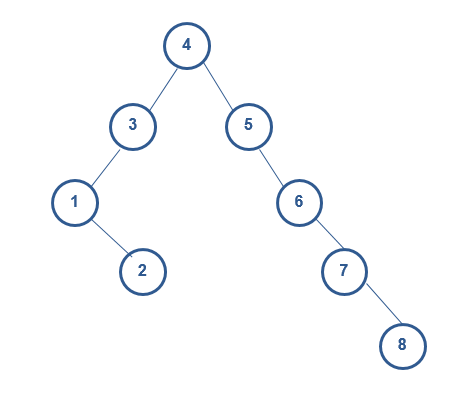
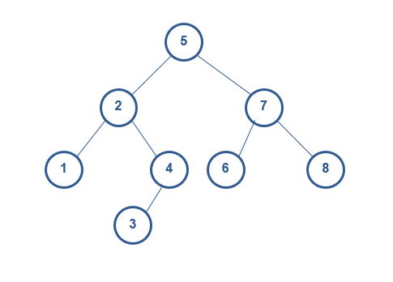
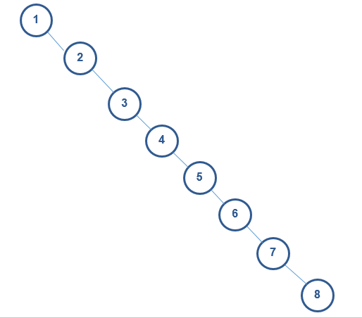
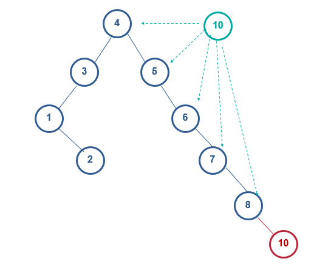
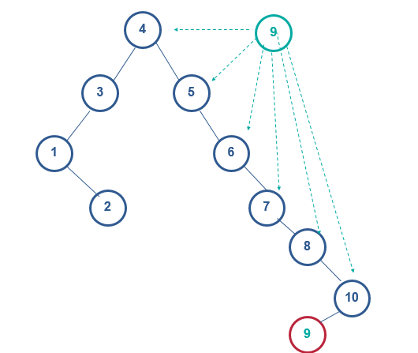
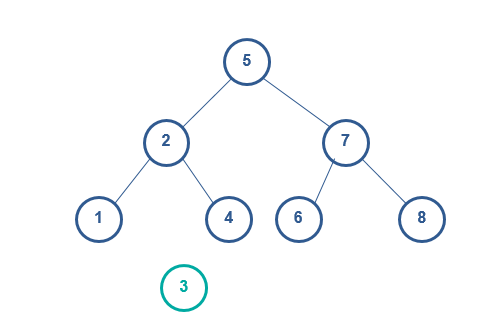
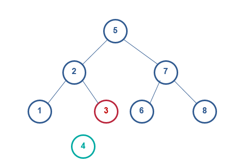
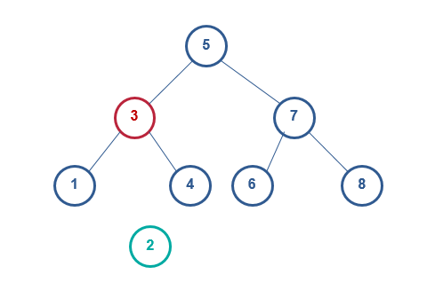

https://troywu0.gitbooks.io/spark/content/%E4%BA%8C%E5%8F%89%E6%90%9C%E7%B4%A2%E6%A0%91.html

当所有的静态查找结构添加和删除一个数据的时候，整个结构都需要重建。这对于常常需要在查找过程中动态改变数据而言，是灾难性的。因此人们就必须去寻找高效的动态查找结构，我们在这讨论一个非常常用的动态查找树——**二叉查找树** 。

**二叉查找树的特点**

下面的图就是两棵二叉查找树，我们可以总结一下它的特点：

(1) 若任意节点的左子树不空，则左子树上所有节点的值均小于它的根节点的值

(2) 若任意节点的右子树不空，则右子树上所有节点的值均大于它的根节点的值

(3) 任意节点的左、右子树也分别为二叉查找树

(4) 没有键值相等的节点

## 插入

我们需要在a图插入节点10

1) 数10和根节点4比较(10>4)，则10放在节点4的右子树中。

2) 接着，10和节点5比较(10>5)，则10放在节点5的右子树中。

3) 依次类推：直到10和节点8比较(10>8)，则10放在节点8的右子树中，成为节点8的右孩子。

在a图插入节点9

重复上述的步骤后，

4) 9比节点10比较（9<10），则10放在节点10的左子树种，成为节点10的左孩子

这个过程我们能够发现，动态添加任何一个数据，都会加在原树结构的叶子节点上，而不会重新建树。 

## 删除

**当删除的节点没有子节点时**，直接删除该节点

**当删除的节点只有1个子节点时**，将子节点替换为要删除的节点即可

**当删除的节点有2个子节点时**，问题就要更复杂了，需要改变子树的结构，但所需要付出的代价很小

例如我们在b图中要删除2,

1) 找的节点2的右子节点中的最小节点3

2) 用最小节点3替换节点2

## 查找

根据二叉查找树的规律，查找节点不需要遍历整个数，如果小于节点，就在左子树中查找，如果大于节点就在右子树中查找。但是不同的数据，可能查找次数不同。

例如查找8，图a需要5次，图b需要3次，图c需要8次

最坏情况下，构成的二叉排序树蜕变为单支树，树的深度为n，其查找时间复杂度与顺序查找一样O(N)。最好的情况是二叉排序树的形态和折半查找的判定树相同，其平均查找长度和log2(N)成正比 （O(log2(n))）。 这说明：同样一组数据集合，不同的添加顺序会导致查找树的结构完全不一样，直接影响了查找效率。**平衡二叉树用来解决这个问题**