https://troywu0.gitbooks.io/spark/content/%E5%B9%B3%E8%A1%A1%E4%BA%8C%E5%8F%89%E6%A0%91.html

https://zhuanlan.zhihu.com/p/25239615

https://juejin.im/entry/586876771b69e6006b42b94f

不同结构的二叉查找树，查询效率有很大的不同，单支树结构的查找效率退化成了顺序查找。解决这个问题的关键在于最大限度的减小树的深度。 

**平衡二叉查找树**，又称 AVL树。 它除了具备二叉查找树的基本特征之外，还具有一个非常重要的特点：它 的左子树和右子树都是平衡二叉树，且左子树和右子树的深度之差的绝对值（**平衡因子** ） 不超过1。 也就是说AVL树每个节点的平衡因子只可能是-1、0和1（左子树高度减去右子树高度）。通俗来讲就是父节点的左子树和右子树的高度之差不能大于1，也就是说不能高过1层，否则该树就失衡了，此时就要旋转节点。 

那么如何是二叉查找树在添加数据的同时保持平衡呢？基本思想就是：当在二叉排序树中插入一个节点时，首先检查是否因插入而破坏了平衡，若  破坏，则找出其中的最小不平衡二叉树，在保持二叉排序树特性的情况下，调整最小不平衡子树中节点之间的关系，以达 到新的平衡。所谓最小不平衡子树  指离插入节点最近且以平衡因子的绝对值大于1的节点作为根的子树。

**平衡因子**

每个结点的平衡因子就是该结点的左子树的高度减去右子树的高度，平衡二叉树的每个结点的平衡因子的绝对值不会超过2 

## 查找

与二叉搜索树相同

## 旋转

在平衡二叉树中插入结点与二叉查找树最大的不同在于要随时保证插入后整棵二叉树是平衡的。那么**调整不平衡树的基本方法就是： 旋转 。** 

**右旋**
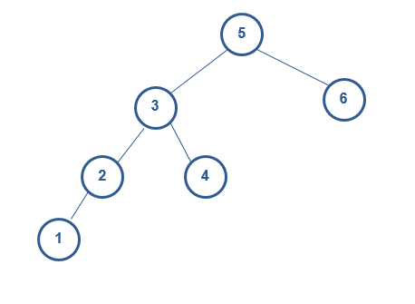
右旋后
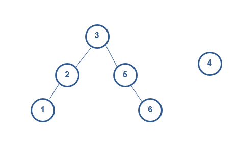
节点4暂时脱离树
插入节点4
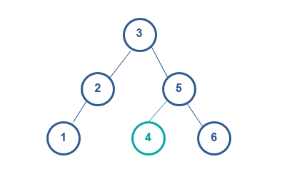

**左旋**

与右旋类似，只是方向不同

## 失衡

有了旋转的概念后，我们接着了解如何通过旋转来修复一棵失衡的二叉树，这里假设结点X是失衡点，它必须重新恢复平衡，由于任意结点的孩子结点最多有两个，而且导致失衡的必要条件是X结点的两棵子树高度差为2(大于1)，因此一般只有以下4种情况可能导致X点失去平衡：   

1. 在结点X的左孩子结点的左子树中插入元素 
2. 在结点X的左孩子结点的右子树中插入元素 
3. 在结点X的右孩子结点的左子树中插入元素
4. 在结点X的右孩子结点的右子树中插入元素  

对于上述失衡，其中1和4是对称的，只需要做单旋转即可，2和3是对称的，需要双旋转

**左左** 
右旋
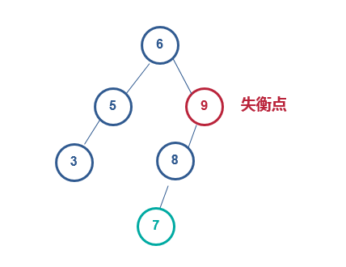
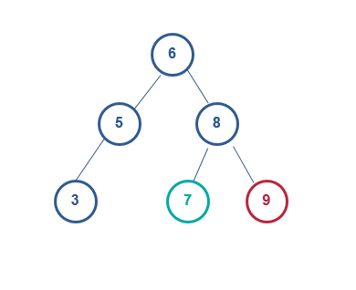

**右右** 
左旋
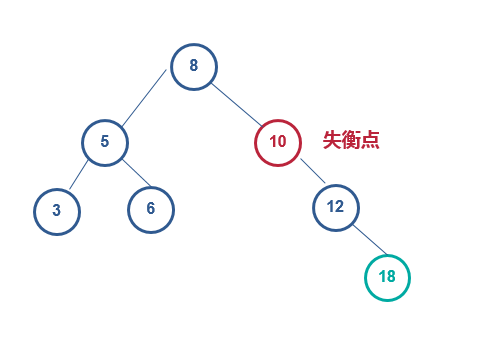
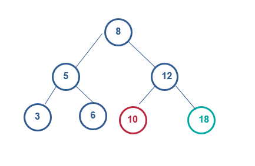

**左右**
先绕X的左子节点Y左旋转，接着再绕X右旋转 
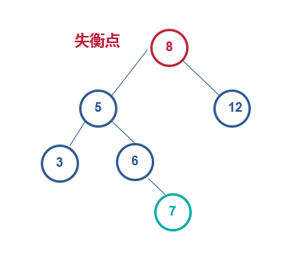
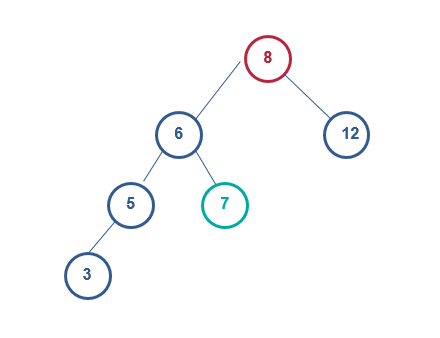
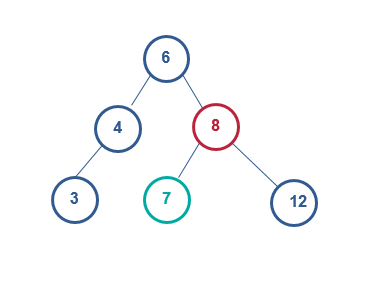

**右左**
先绕X的右子节点Y右旋转，接着再绕X左旋转 
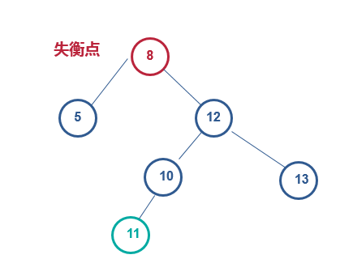
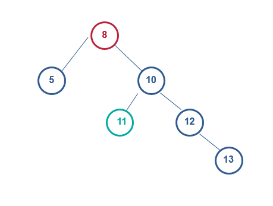
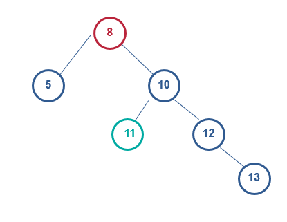

平衡二叉树的优势在于不会出现普通二叉查找树的最差情况。其查找的时间复杂度为O(logN)。但是为了保证高度平衡，动态插入和删除的代价也随之增加