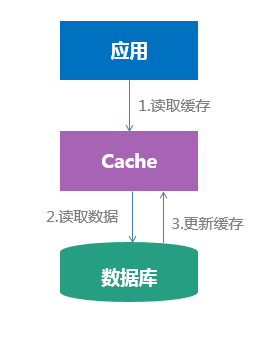
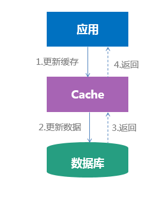
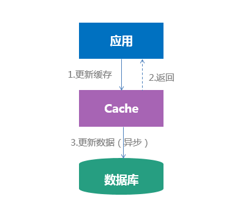

http://blog.jobbole.com/83439/

https://segmentfault.com/a/1190000005886009

http://mp.weixin.qq.com/s?__biz=MjM5ODYxMDA5OQ==&mid=404087915&idx=1&sn=075664193f334874a3fc87fd4f712ebc&mpshare=1&scene=23&srcid=1013nFtafpDeYoP8G8hm4iqs#rd

http://tech.meituan.com/cache_about.html

http://coolshell.cn/articles/17416.html​

# 缓存算法

- FIFO算法：First in First out，先进先出。原则：一个数据最先进入缓存中，则应该最早淘汰掉。也就是说，当缓存满的时候，应当把最先进入缓存的数据给淘汰掉。
- LFU算法：Least Frequently Used，最不经常使用算法。
- LRU算法：Least Recently Used，近期最少使用算法。请查看：Memcached之你真正理解LRU吗(4)

LRU和LFU的区别。LFU算法是根据在一段时间里数据项被使用的次数选择出最少使用的数据项，即根据使用次数的差异来决定。而LRU是根据使用时间的差异来决定的。

# 使用缓存

缓存的操作流程一般是这样的：

1. 读取缓存中是否有相关数据
2. 如果缓存中有相关数据，直接返回（缓存命中“hit”）
3. 如果缓存中没有相关数据，则从数据库读取相关数据（缓存未命中“miss”），再将数据放入缓存，然后返回。

伪代码：
 
	Object value = cache.get(key);
	if (value != null) {
		return value;
	}
	value = db.get(key);
	if (value != null) {
		cache.put(key, value)
	}
	return value;

缓存的命中率 = 命中缓存请求个数/总缓存访问请求个数 = hit/(hit+miss)

对于一般的应用的话db的读写频率的比例大约在10:1左右，读的次数明显大于写的次数，大多数请求到了缓存这里就给搞定了，只有少量的穿透来维护数据的更新.这种做法是明智的，服务器读内存的速度比读硬盘的速度快 10^5-10^6倍，使用缓存可以大大增加用户的响应速度和服务器的处理能力。

然而上述的代码却存在一些比较公共的缓存问题

# 缓存并发
一个缓存如果失效，可能出现多个进程同时查询DB，同时设置缓存的情况，如果并发确实很大，这也可能造成DB压力过大，还有缓存频繁更新的问题。

解决思路：

对缓存查询加锁，如果KEY不存在，就加锁，然后查DB入缓存，然后解锁；其他进程如果发现有锁就等待，然后等解锁后返回数据或者进入DB查询。但这样会降低系统的吞吐量。

因为字符串也是共享的，我们直接锁缓存key，会阻塞其他使用这个字符串的操作行为，所以我们要加锁的字符串要是一个基于KEY生成的特殊对象.

	Object value = cache.get(key);
	if (value != null) {
		return value;
	}
	String lockKey = key + "1190000005886009";
	synchronized (lockKey) {
		value = cache.get(key);
		if (value != null) {
			return value;
		}
		value = db.get(key);
		if (value != null) {
			cache.put(key, value)
		}
		return value;
	}

**在获取到锁之后，我们需要再次从缓存中读取数据，如果有相关数据之间返回**

# 缓存穿透
缓存穿透是指用户查询的数据在数据库一定没有，自然在缓存中也不会有。这样就导致用户查询的时候，每次都要去数据库中查询。在流量大时，可能数据库就挂掉了。

在主从架构，读写分离中，如果写到主库却未同步到从库，就会出现请求穿透到数据库的情况

解决思路：

1. 如果查询数据库也为空，直接设置一个默认值存放到缓存，这样第二次到缓冲中获取就有值了，而不会继续访问数据库，这种办法最简单粗暴。

比如我们这个不存在的key预先设定一个特定值"NOT_EXISTS"。在缓存返回这个NOT_EXISTS值的时候，我们的应用就可以认为这是不存在的key，那调用方就可以决定是等待一段事件后重试，还是直接返回不存在。

当然在该KEY对应的数据被插入之后，应该清理缓存，或者将不存在KEY的缓存时间稍微设置短一点。

	Object value = cache.get(key);
	if (value != null) {
		return value;
	}
	String lockKey = key + "1190000005886009";
	synchronized (lockKey) {
		value = cache.get(key);
		if (value != null) {
			return value;
		}
		value = db.get(key);
		if (value == null) {
			value = "NOT_EXISTS"
		}
		cache.put(key, value)
		return value;
	}

2. 采用布隆过滤器，将所有可能存在的数据哈希到一个足够大的BitSet中，不存在的数据将会被拦截掉，从而避免了对底层存储系统的查询压力。关于布隆过滤器可以在网上搜索相关介绍，它的原理就是利用多个HASH算法将一个对象映射成一个bit数组(也称为bitmap)里面的多个点。以后判断就只要HASH后和数组里面的值亦或下就好了，效率很高。

当缓存空间满了，同步失败，网络阻塞，缓存写失败等原因，会出现缓存服务器上并没有这个key。或者因为同步中断，在主从架构中，写到主却未同步到从的悲剧，就会出现请求穿透到DB层的情况。

当发生大量的缓存穿透，例如对某个失效的缓存的大并发访问就造成了缓存雪崩。

# 缓存雪崩
缓存雪崩是由于在缓存失效(缓存服务器重启或者大量缓存集中在某一个时间段失效)，新缓存还未到的中间时间内，所有请求都会去查询数据库，而对数据库造成巨大压力甚至宕机。

解决思路：

1. 在缓存失效后，通过加锁或者队列来控制读数据库写缓存的线程数量。比如对某个key只允许一个线程查询数据和写缓存，其他线程等待。这种办法虽然能缓解数据库的压力，但是同时又降低了系统的吞吐量。和缓存并发是同一种处理方式。
2. 不同的key，设置不同的过期时间，让缓存失效的时间点尽量均匀。避免缓存雪崩的出现。
3. 二级缓存，A1为原始缓存，A2为拷贝缓存，A1缓存失效时间设置为短期，A2设置为长期，当A1失效的时候，利用同步（或者其他手段）让一个线程去查询并更新缓存，其他线程直接返回C2的数据。
4. 使用分布式缓存。设计合理的缓存分布算法，让缓存均匀地分布到各个节点，这样一台缓存服务器挂了只是有部分缓存丢失，不会所有压力集中到数据库

加锁排队只是为了减轻数据库的压力，并没有提高系统吞吐量。假设在高并发下，缓存重建期间key是锁着的，这是过来1000个请求999个都在阻塞的，同样会导致用户等待超时。对于这个问题对应的解决思路是：

**给每一个缓存数据增加相应的缓存标记，记录缓存的是否失效，如果缓存标记失效，则更新数据缓存。**

	Object value = cache.get(key);
	//获取标记值
	String cacheSign = key + "_Sign";
	Object sign = cache.get(cacheSign)
	if (sign == null) {
		//过期，用一个线程在后台更新缓存
		new Runnable() {
			Object v = db.get(key);
			cache.put(key, v, cacheTime * 2);
			cache.put(cacheSign, cacheSign, cacheTime);
		}.start()
	}
	return value;//会出现脏数据

- 缓存标记：记录缓存数据是否过期，如果过期会触发通知另外的线程在后台去更新实际key的缓存。
- 缓存数据：它的过期时间比缓存标记的时间延长1倍，例：标记缓存时间30分钟，数据缓存设置为60分钟。 这样，当缓存标记key过期后，实际缓存还能把旧数据返回给调用端，直到另外的线程在后台更新完成后，才会返回新缓存。

# 缓存预热

缓存预热就是系统上线后，将相关的缓存数据直接加载到缓存系统。这样避免在用户请求的时候，再去加载相关的数据。

在单机系统情况下比较简单：

1. 直接写个缓存刷新页面，上线时手工操作下
2. 数据量不大，可以在WEB系统启动的时候加载
3. 搞个定时器定时刷新缓存，或者由用户触发都行

分布式缓存系统，如Memcached，Redis，比如缓存系统比较大，由十几台甚至几十台机器组成，这样预热会复杂一些：

解决思路：

1. 写个程序去跑
2. 单个缓存预热框架

# 更新缓存与淘汰缓存
当数据发生变化的时候，对缓存有两种处理策略：
- 更新缓存：数据不但写入数据库，还会写入缓存，缓存不会增加一次miss，命中率高，但处理复杂
- 淘汰缓存：数据只会写入数据库，不会写入缓存，只会把数据淘汰掉，增加了一次cache miss，但处理简单

如果更新缓存的代价很小，我们应该更倾向于更新缓存，以保证更高的缓存命中率

## 淘汰缓存的数据一致性
因为写数据库与淘汰缓存不能保证原子性，所以先写数据库，再淘汰缓存会带来数据不一致的问题。

**先写数据库，再淘汰缓存**：第一步写数据库操作成功，第二步淘汰缓存失败，则会出现数据库中是新数据，缓存中是旧数据，数据不一致。

**先淘汰缓存，再写数据库**：第一步淘汰缓存成功，第二步写数据库失败，则只会引发一次Cache miss。

所以数据和缓存的操作时序应该为：先操作缓存，再写数据库

## 更新缓存的数据一致性
因为写数据库与更新缓存不能保证原子性，两个操作的操作时序是什么样的都会有数据不一致的情况发生。

**先写数据库，再更新缓存**：第一步写数据库操作成功，第二步更新缓存失败，则会出现数据库中是新数据，缓存中是旧数据，数据不一致。

**先更新缓存，再写数据库**：第一步更新缓存成功，第二步写数据库失败，会出现数据库中是旧数据，缓存中是新数据，数据不一致。

可以将更新缓存的早改为消息通知的方式处理。在写数据库成功之后，发送消息通知数据变更。缓存同步系统收到消息变更消息之后更新缓存。
但是这个方法也不能保证消息不丢失，所以还要记录写数据库的日志，当消息丢失了回放日志来更新缓存;或者通过读取binlog的方式更新缓存

**因为淘汰缓存的策略实现更简单，所以推荐使用淘汰缓存的策略**

# 数据一致性
在并发条件下，依然会存在数据不一致的情况。

假设我们只有一个数据库，有两个请求A和B

1. A发起一个写操作，淘汰缓存之后，因为某些原因卡住了
2. B发起一个读请求，从缓存中没有读取到数据
3. B从数据库读取数据，读出来一个脏数据，并写入缓存
4. A将数据写入数据库

之后所有的读请求都会从缓存中读取到脏数据，实际上数据库中的数据已经更新了。

更糟糕的是假设我们实现了主从复制和读写分离，写操作A写入主库，读操作B读取从库。即使A和B的时序没有乱，但由于主从复制的延时，B依然会读取到脏数据并写入缓存。

解决思路：
在写入数据库之后再做一次淘汰缓存的操作。**第二次淘汰缓存的操作不应该立即执行，而是应该根据主从同步的时延来计算出一个延时时间，将更新缓存的操作作为一个延时任务处理**

缓存双淘汰法：
1. 淘汰缓存
2. 写入数据库
3. 发送一个消息，下游订阅这个消息，并在延时时间之后处理这个消息。

虽然上述方案在延时时间内也会有脏数据的问题，但是在延时时间之后这个脏数据就会被淘汰掉。

当然，我们也可以通过读取binlog的方式来淘汰缓存。

# 写多读少的缓存
http://mp.weixin.qq.com/s?__biz=MjM5ODYxMDA5OQ==&mid=2651959502&idx=1&sn=7a1c7d81a8e030856fb920844dc571c6&mpshare=1&scene=23&srcid=1013xzl59vdR3cTLB0jMuVqX#rd

前面我们所说的缓存大部分都是在处理读远大于写的缓存，但是有一类写多读少的业务场景：大部分请求是对数据进行修改，少部分请求对数据进行读取。例如滴滴打车，某个司机地理位置信息的变化（可能每几秒钟有一个修改），以及司机地理位置的读取（用户打车的时候查看某个司机的地理位置）。

在底层我们可能使用一个Map来存储所有的司机数据Map<driver_id, DriverInfo>，那么这个map就是一个临界资源，多个线程之间会存在竞争关系，所以我们对map的操作需要加锁

	void SetDriverInfo(long driver_id, DriverInfo info){
		WriteLock (m_lock);
		Map<driver_id>= info;
		UnWriteLock(m_lock);
	}
	
	DriverInfo GetDriverInfo(long driver_id){
		DriverInfo t;
		ReadLock(m_lock);
		t= Map<driver_id>;
		UnReadLock(m_lock);
		return t;
	}

当时上述的代码在并发量很大的时候锁会成为性能瓶颈

# 分段锁
可以采用水平切分和分段锁的方案来减少锁的粒度

	void SetDriverInfo(long driver_id, DriverInfo info){
		i= driver_id % N; // 水平拆分成N份，N个Map，N个锁
		WriteLock (m_lock [i]);  //锁第i把锁
		Map[i]<driver_id>= info;  // 操作第i个Map
		UnWriteLock (m_lock[i]); // 解锁第i把锁
	}

每个Map的并发量（变成了1/N）和数据量都降低（变成了1/N）了，所以理论上，锁冲突会成平方指数降低。

# 行级锁
假设driver_id是递增生成的，并且缓存的内存比较大，是可以把Map优化成Array，而不是拆分成N个Map，是有可能把锁的粒度细化到最细的（每个记录一个锁）。

	void SetDriverInfo(long driver_id, DriverInfo info){
		index= driver_id;
		WriteLock (m_lock [index]);  //超级大内存，一条记录一个锁，锁行锁
		Array[index]= info; //driver_id就是Array下标
		UnWriteLock (m_lock[index]); // 解锁行锁
	}

和上一个方案相比，这个方案使得锁冲突降到了最低，但锁资源大增，在数据量非常大的情况下，一般不这么搞。数据量比较小的时候，可以一个元素一个锁的（典型的是连接池，每个连接有一个锁表示连接是否可用）

上文中提到的另一个例子，用户操作类型计数，操作类型是有限的，即使一个type一个锁，锁的冲突也可能是很高的，还没有方法进一步提高并发呢？

# 去掉锁

void AddCountByType(long type){
	//不加锁
	Array[type]++; // 计数++
}

如果这个缓存不加锁，当然可以达到最高的并发，但是多线程对缓存中同一块定长数据进行操作时，有可能出现不一致的数据块，这个方案为了提高性能，牺牲了一致性。在读取计数时，获取到了错误的数据，是不能接受的（作为缓存，允许cache miss，却不允许读脏数据）

这个并发写的脏数据是如何产生的呢，详见下图：

1. 线程1对缓存进行操作，对key想要写入value1
2. 线程2对缓存进行操作，对key想要写入value2
3. 如果不加锁，线程1和线程2对同一个定长区域进行一个并发的写操作，可能每个线程写成功一半，导致出现脏数据产生，最终的结果即不是value1也不是value2，而是一个乱七八糟的不符合预期的值value-unexpected。

并发写入的数据分别是value1和value2，读出的数据是value-unexpected，数据的篡改，这本质上是一个数据完整性的问题。

“签名”是一种常见的保证数据完整性的常见方案

**加上签名之后的流程**

加上签名之后，不但缓存要写入定长value本身，还要写入定长签名（例如16bitCRC校验）：

1. 线程1对缓存进行操作，对key想要写入value1，写入签名v1-sign
2. 线程2对缓存进行操作，对key想要写入value2，写入签名v2-sign
3. 如果不加锁，线程1和线程2对同一个定长区域进行一个并发的写操作，可能每个线程写成功一半，导致出现脏数据产生，最终的结果即不是value1也不是value2，而是一个乱七八糟的不符合预期的值value-unexpected，但签名，一定是v1-sign或者v2-sign中的任意一个 
4. 数据读取的时候，不但要取出value，还要像消息接收方收到消息一样，校验一下签名，如果发现签名不一致，缓存则返回NULL，即cache miss。

# 缓存的几种使设计模式

## Cache-Aside
Cache-Aside是缓存最常用的模式

- 当一个应用程序需要数据时，首先在缓存中查找；如果在缓存中取到了数据，直接使用这个数据**（命中**）；如果没有取到数据，则从数据库中取数据，取到之后在放入缓存**（未命中）**
- 应用程序更新数据时，先将数据写入数据库，然后在让缓存失效

这种模式下应用程序负责对数据库的读写，而缓存不与数据库交互。缓存被"kept aside"(放在一边)，作为一个更快速的内存数据存储。应用程序在读取数据库中的任何数据之前先检查缓存。同时，应用程序在对数据库进行任何更新后需要更新缓存。通过上述的操作应用程序确保缓存与数据库保持同步。

## Read Through

应用程序从缓存中读取数据,如果从缓存中取到了数据，直接使用这个数据；如果未命中，则由缓存从数据库中取出数据，并更新缓存（不再由调用方负责）。

## Write Through

与Read Through类似，应用程序直接更新缓存，然后再由缓存更新数据库。如果缓存和数据库都被更新成功，则认为写入操作成功（同步操作）。**如果缓存写入成功，数据库写入失败，需要考虑回退的问题**

## Write Behind Caching Pattern

我们也可以将数据库更新改为延迟更新：只要数据被写入缓存，就认为是成功的，然后再通过异步方式更新数据库。**数据不是强一致性的，可能会丢失**

